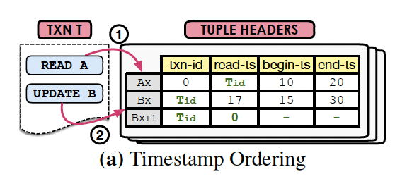
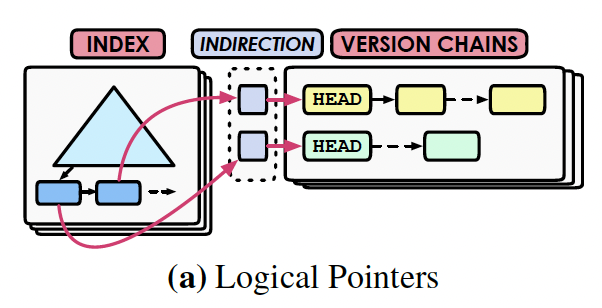
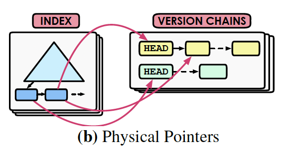

An Empirical Evaluation of In-Memory Multi-Version Concurrency Control

以经验依据的内存多版本并发控制评估

MVCC 在70年代晚期诞生

这篇论文研究在多核、内存环境下多线程并行运行的并发控制的扩展性

并发控制的4个核心：

- concurrency control protocol
- version storage
- garbage collection
- index management

这个研究想要探索每种实现方式中的瓶颈点

MVCC 对一个逻辑对象可以维护多个版本的物理对象。这个对象的粒度是不定的，一般是tuple。

MVCC的一个很重要的优点是允许读取旧版本的数据，进而提升并行性。

文中的测试都是在 Peloton 基础上做的。

## 相关的meta-data：

- transaction：事务开始时 DBMS 给每个事务一个单调递增的时间戳作为事务ID。使用这个ID作为tuple 版本号区分的标识。
- tuple: 每个物理tuple有4个元数据字段 `txn-id, begin-ts, end-ts, pointer`。`txn-id`可以作为tuple的锁，0表示没有人加锁。`begin-ts` 和 `end-ts` 表示tuple的生命周期。`pointer` 指向最近的另一个版本 tuple。

# Concurrency Control Protocol

协调并发事务的运行。 ref Concurrency Control and Recovery in Database Systems

做两件事情：

1. 运行期决定一个事务是否可以访问或修改特定版本的tuple
2. 决定是否允许一个事务提交

实现 serializable 功能有两种做法：

1. 索引上加额外的latch
2. 在事务提交的时候做校验

这里介绍了4中MVCC，都是tuple-level的。

## Timestamp Ordering (MVTO)

最原始的MV并发控制协议。

关键点是使用时间戳做串行化顺序排序。

tuple-header上增加一个额外的字段 `read-ts` 表示读取这个 tuple 的事务中最大的 Tid。

如果tuple上加着写锁，那么其它事务尝试读/写这个tuple时，会终止掉它们。

读取tuple时，如果当前的Tid比tuple `read-ts` 大，就会更新。

更新：

总会更新最新的tuple。

没有其它事务加写锁；

Tid比要更新的tuple `read-ts` 要大；

复制一份新版本，在新版本上做更新。

提交时，旧版本的 `end-ts` 设置为 Tid，新版本的`begin-ts, end-ts` 设置为 Tid 和 INF。

## Optimistic Concurrency Control (MVOCC)

这个协议假设事务访问tuple时，冲突是非常少的，因此不需要加读写锁。

一个事务分为三个阶段：

1. 事务开始，进入 `read phase`。事务执行读写操作
2. 执行结束，准备提交，进入 `validation phase`。 事务先拿到另一个时间戳 Tcommit，用来确定串行化顺序。校验：对比下read-set，判断这段时间提交的事务是否修改过，修改过就是有冲突。
3. 通过校验阶段，进入 `write phase`。 更新的版本都设置`begin-ts` 为 Tcommit， `end-ts` 设置为INF。

相关论文：On Optimistic Methods for Concurrency Control.

## Two-phase Locking (MV2PL)

参考论文： Concurrency Control and Recovery in Database Systems

写锁使用 `txn-id` 字段

读锁使用`read-cnt`字段，表示当前有多少个事务在读取。

读：找到一个合适版本的tuple，给`read-cnt`加1

写：更新某个版本的tuple，必须`read-cnt` 和 `txn-id` 都是0。

2PL之间的区别是怎么处理deadlock问题：

- No-wait 策略。最具有可扩展性的死锁预防方法

## Serialization Certifier

维护一个串行化图`serialization graph` 来检测和移除 `dangerous structures`。

Certifier-based的算法还可以提供更低级别的隔离

`serializable snapshot isolation` （SSI）通过避免`write-skew` 的snapshot isolation 来保证串行性。

内部图中跟踪 `anti-dependency` 边来保证串行化：当一个事务创建一个新版本时，另一个事务读取这个tuple的旧版本。

当检测到两个连续的 `anti-dependency` 边时，就终止掉其中一个。

`serial safety net (SSN)` 另一个比较新的certifier-based 协议。可以在任意isolation level 上工作。SSN 使用一些方法减少false abort，在read-only或者read-mostly中更适用。

## Discussion

MVOCC 在读写阶段不做任何检测，对并发最友好。但是在校验阶段，需要检查所有的读操作集合，这会导致 starvation of long-running  read-only transaction。

Certifier策略的anti-denpendency会引起额外的overhead。

一些优化的提议：

允许推测读取未提交的数据

允许 eagerly update 其它事务未提交的数据。需要一个中心跟踪依赖的地方。

# Version Storage

version storage scheme 指明系统如何存储这些版本数据，每个版本包含什么信息。

tuple's pointer 字段组成一个链表 `version chain`，链表操作可以是 `latch-free`

## Append-only Storage

所有版本的tuple都保存在同一个存储空间中(PostgreSQL)。

更新：申请一个新的slot，复制旧数据，更新新tuple，链接两个版本

不同实现关键区别是从新到旧，还是从旧到新。

**Oldest-to-Newest(O2N)**: 链表头指向最旧版本。优点：修改的时候，不需要更新索引指向新的版本。缺点：每次需要从最旧的开始遍历，可能会很长。如果回收能力比较强，旧版本比较少，这个策略问题不大。

**Newest-to-Oldest(N2O)**: 链表头指向最新的版本。优点：大部分事务都需要访问比较新的版本的数据，因此不用遍历那么深，就可以访问到需要的版本。缺点：tuple修改的时候，链表头要调整，必须更新所有的索引，指向最新的版本数据。解决方法是，可以找个中间辅助存储，索引指向辅助位置，每次更新时，就只需要更新辅助指针就可以了。

Append-only 方式有另一个问题：如何处理non-inline 属性，比如BLOB字段。解决方法是使用指针指向同一个物理位置。

## Time-Travel Storage

旧点的版本数据单独存放。每个tuple都有一个master版本，存放在main table中，同一个tuple的多个版本存放在单独的time-travel table中。

有些系统将最新版本作为master版本，比如SQL Server。

有些将最旧的版本作为master版本，比如SAP HANA。这需要额外的维护，从time-travel table 中复制数据到 main table中。

下面讨论第一种方案，就是master version是最新版本的tuple。更新一个tuple的时候，在time-travel table中申请一个slot，然后复制master version，修改master version，存放在main table中（不知道怎么做的）。索引都不需要更新，因为指向了master version。从老师胶片上看到的：复制当前版本到time-travel table，更新指针，重写main table中的master version，更新指针。

## Delta Storage

在main table中管理master version，使用单独的delta storage 存储一系列 delta version。

在MySQL和Oracle中，被称为rollback segment。

HyPer也是这种方法。

更新时，在delta storage中申请一块连续存储空间，这个空间中记录修改的那部分属性的原始值，修改时直接在main table 改master version。

缺点：读取历史数据的时候，需要遍历很长。

# Garbage Collection

MVCC系统的性能对GC的依赖比较强。

GC分为三步：

1. 检测过期版本
2. 从关联链表和索引中脱离关系
3. 回收存储空间

过期版本判断条件：

- invalid version（abored transaction 创建的）；
- 对所有活跃事务都不可见：`end-ts` 小于所有活跃事务的 Tid

系统需要维护一个中心化结构来跟踪这个信息，因此是一个瓶颈点。

这里介绍了一种in-memory DBMS优化的方法。

An in-memory DBMS can avoid this problem with coarse-grained epoch-based memory management that tracks the versions created by transactions [44]. in-memory DBMS 可以通过粗粒度的epoch-based 内存管理，来跟踪事务创建的版本。There is always one active epoch and an FIFO queue of prior epochs.总是存在一个活跃的epoch，还有一个先前epoch的FIFO队列。 After some amount of time, the DBMS moves the current active epoch to the prior epoch queue and then creates a new active one. 过一段时间，DBMS将当前的epoch移动到先前epoch队列，然后再创建一个新的。This transition is performed either by a background thread or in a cooperative manner by the DBMS’s worker threads. 这个转换是由后台线程，或者工作线程协作完成的。 Each epoch contains a count of the number of transactions that are assigned to it. 每个epoch都包含了分配给它的事务的数字(a count of)。 The DBMS registers each new transaction into the active epoch and increments this counter. DBMS在活跃epoch中注册每个新事务并且增加这个计数。When a transaction finishes, the DBMS removes it from its epoch (which may no longer be the current active one) and decrements this counter. 当事务结束时，DBMS从epoch（可能不再是活跃的）中将它移除，并且减去counter。If a non-active epoch’s counter reaches zero and all of the previous epochs also do not contain active transactions, then it is safe for the DBMS to reclaim expired versions that were updated in this epoch.如果有一个非活跃epoch的计数达到0，并且所有先前的epoch都不包含活跃事务，那么DBMS就可以安全的回收这个epoch相关的版本。

参考 Speedy Transactions in Multicore In-Memory Databases.

有两种查找过期版本的方法：

- DBMS 检测单独的tuple的可见性(tuple-level)
- transaction-level: GC 检查已经结束的某个事务创建的版本是否还是可见的。

这些检测方法并不是对所有的version storage都可用的。

## Tuple-level Garbage Collection

两种方式检测每个tuple的可见性

**Background Vacuuming (VAC)**: 后台线程周期性检测过期版本。这种方式的可扩展性比较差，尤其是后台线程数比较少的时候。优化方案：

- 事务注册失效的版本到一个latch-free的数据结构(High-Performance Concurrency Control Mechanisms for Main-Memory Databases)，GC线程使用上面描述的epoch-base方法优化回收
- 维护一个脏块的bitmap，那么上次GC之后，没有修改的块，就不需要再次检测

**Cooperative Cleaning (COOP)**： 某个事务在运行时，查找可见版本的时候，顺便把过期的版本找出来。仅适用于O2N方式。有个风险是如果事务一直没有访问过某个tuple，那一直不会被回收。解决方法就是跟VAC一起配合。

## Transaction-level Garbage Collection

DBMS认为一个事务创建的所有版本对所有活跃事务都不可见就是过期了。在这个epoch结束的时候，这个epoch的所有事务创建的版本，都可以回收。缺点：需要跟踪每个epoch的事务的读写集合。

# Index Management

索引存储两个信息：一个是索引本身的值，一个是指向tuple的指针

索引区分两种类型，一个是primary key，一个是secondary key。

Primary key 修改的话，一般会执行 DELETE + INSERT 操作。

secondary index包含一个指针指向tuple。这个指针可以是logical pointer，也可以是physical pointer。

## Logical Pointer

tuple有一个固定的ID，不会改变，索引的指针就指向它。优点：tuple修改时，不需要调整索引的信息，只需要修改指针的映射（mapping）信息。缺点：索引不一定能够指向最新的信息，而是需要去遍历version chain。

**Primary Key (PKey):** ID就是tuple 的primary key。secondary index先定位primary key，然后再找tuple。如果secondary index覆盖了primary key，那就不用存放整个primary key。

** Tuple Id（TupleId) **: Pkey的方案缺点是，primary key比较大时，需要的存储空间也会变大。替代方案是使用一个有顺序的数据结构替代primary key，这样需要额外的花时间查找。比如使用一个64-bit的tuple id。

## Physical Pointer

索引中直接存放物理地址。只能用于append-only方案。

更新tuple时，需要更新index信息。

示例：MemSQL、Hekaton

## Discussion

Logical Pointer的方案对写密集型比较友好。Physical Pointer的方案是相反的。

MVCC系统中index-only scan是没办法做到的，除非索引中也包含版本信息。

# EXPERIMENTAL ANALYSIS

这里做了一些实验，并分析了多种场景下每个策略的表现以及扩展性分析。

使用YCSB和TPC-C来测试。
