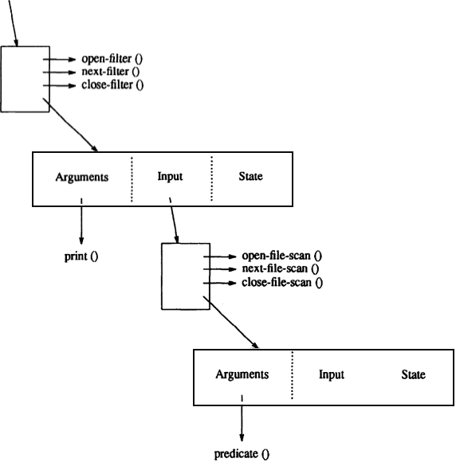
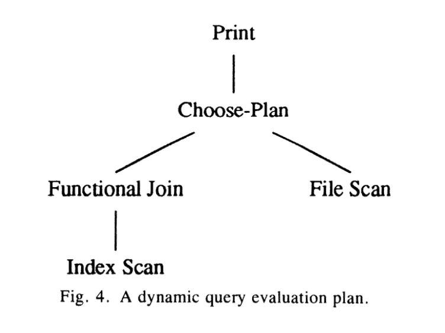
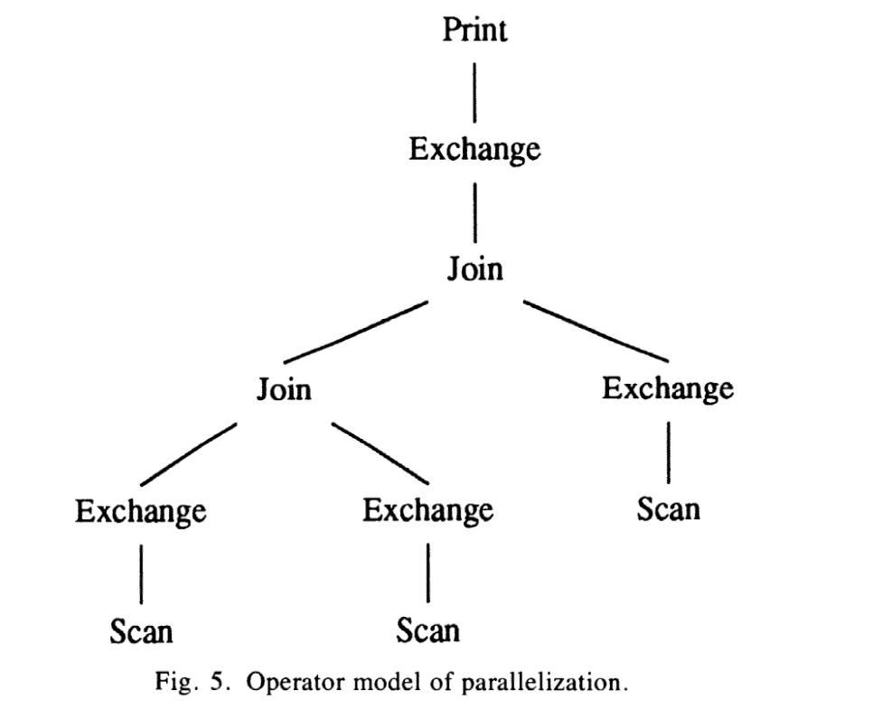
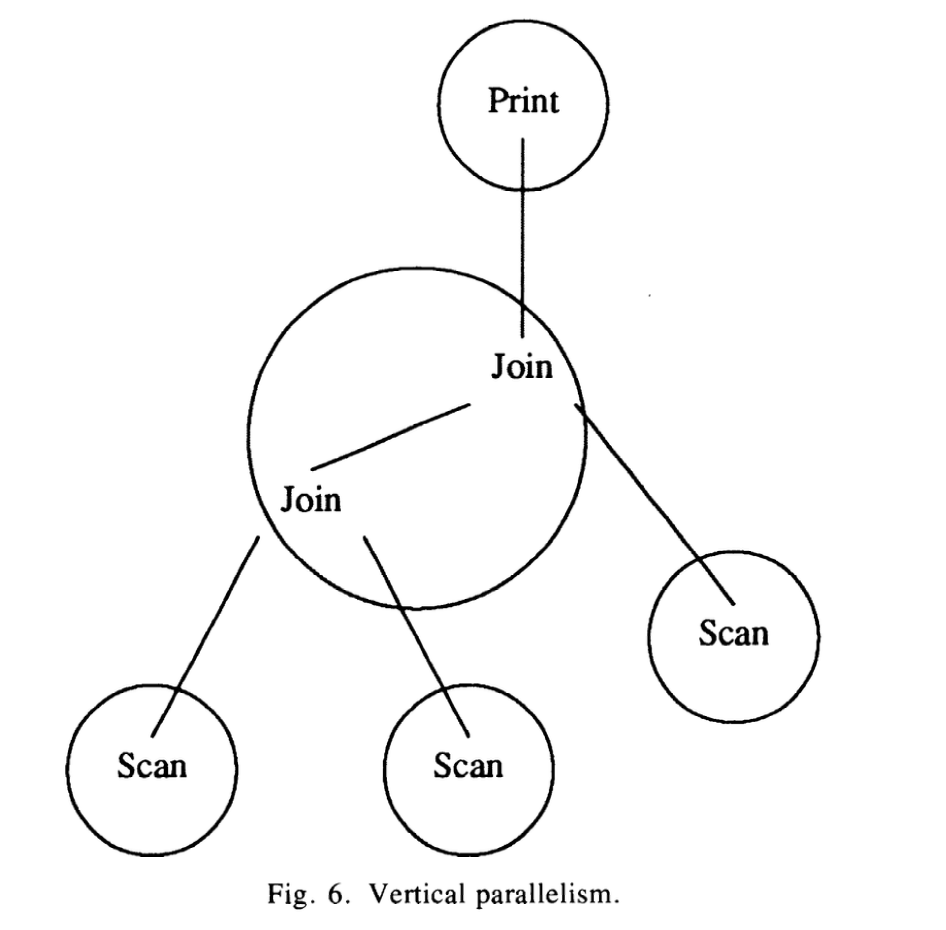
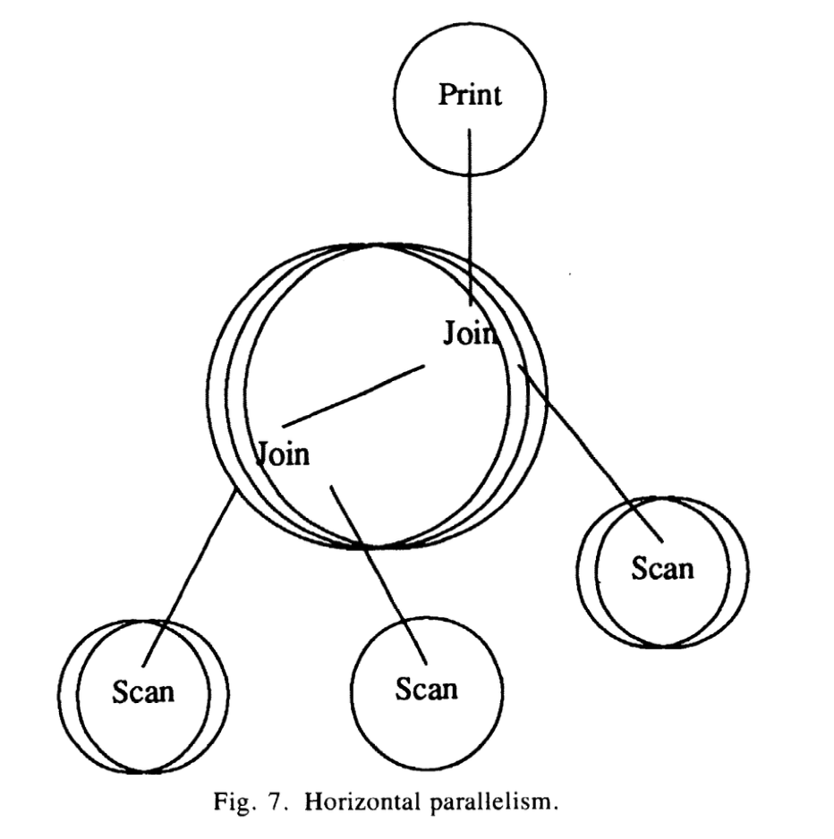

Volcano	An Extensible and Parallel Query Evaluation System

--by Goetz Graefe
# 个人总结
- Volcano 火山模型
- Volcano是当前数据库SQL层常用的一个查询计划执行模型
- 设计目标是一个极具扩展性、高性能的查询系统
- 常见概念有operator、iterator
- 抽象做的非常好，各种执行都抽象为operator，数据流转抽象为iterator
- 设计两个meta-operator，一个choose-plan operator支持动态选择执行计划，一个exchange-operator，支持并行查询
- 机制与策略分离，支持support function，参数可控
- 不受类型约束

# 概述
Volcano 火山

本文就是介绍火山模型的。

为了研究数据库查询处理的扩展性和并行性，而研发的一个数据流查询执行系统，叫 Volcano .

Volcano 用于教育、研究，用于数据库系统设计、启发式查询优化、并行查询与资源分配。

# 1. Introduction
Volcano不是一个完整的数据库系统，不包含类型系统和record定义，也不包含查询优化等。

首先，可以为了未来的研究，是模块化和扩展的，比如算法、数据模型、资源分配、并行执行、负载均衡和启发式查询优化。
Volcano的只是提供了一个实验研究的基础设施，而不是一个最终的研究模型。
其次，Volcano设计的简单性让学生更容易使用和研究。模块化和简单性是非常重要的。
第三，Volcano的设计不假设任何特定的数据模型，唯一的假设是查询处理都是参数化算子之间传递数据集合。
为了达到数据模型的独立性，从设计上区分集合处理控制(set processing control)与数据项的解释(iterpretation)和操作(manipulation).

第四，为了让算法设计、实现、调试、tuning和创建实验从并行(parallelism)的复杂性分离开，但是又允许parallel查询处理实验。
Volcano 可以用于single-process, 也可以用于parallel system.
single-process查询评估计划可以在共享内存机器——也包括分布式内存机器——并行化。

第五，Volcano 是一个现实中的查询执行范式，允许学生学习查询处理在真实的商业数据库产品中如何处理的。
比如，使用临时文件从一个operation传输数据到下一个，会带来巨大的性能损耗，所以在真实的数据库系统中不会这么做，包括Volcano。

最后，Volcano 的并行查询处理不能用于已经存在的模型，因为所有的模型都是基于特定的数据模型和算子集合。
Volcano 的并行处理模型是独立于数据模型和算子的，将parallelism与数据操作分开。

Volcano 还提供了一些机制来支持策略。策略可以通过一个人类实验员或查询优化器来设置。独立的机制和策略让现代操作系统更具有扩展性和模块化，同样也适用于可扩展的数据库系统。

Volcano的目标是为了允许未来扩展和研究，将会持续修改和扩展。最近有两个比较重要的扩展是两个meta-operator的设计和实现。它们包含和封装了查询处理的新概念。它们不用于数据操作、查询和derivation(推导、衍生)，只是提供了一些查询处理上额外的控制机制，这些是其它算子无法提供的，比如file scan、sort和merge join。

Choose-plan operator 实现了动态查询评估计划，为必须利用不完整信息做优化的查询而开发的概念。比如某个查询中有参数变量，这个变量的值在编译和优化的时候是未知的，就不能提前优化。动态计划可以提前准备多个对等的计划，每个对应着实际参数中特定的范围。choose-plan operator在运行时从这里选择。

另一个meta-operator，是exchange operator，在Volcano中的作用是控制并行查询评估。虽然算子间可以不通过exchange operator传递数据，这个新的算子可以方便的在进程间和在处理器边界传递数据。所有并行处理，包括分区和流控，都可以封装在exchange operator中。这样数据操作和并行在实际上，就不相干了。这种方式的处理可以让查询引擎的并行化实际上允许线性或者接近线性的提升。

这篇文章介绍了整体的目标和设计原则。还有一些其它的文章，描述特性领域的内容。

# 2. RELATED WORK

Volcano 系统的设计受了很多系统的影响，比如WiSS, GAMMA和EXODUS。

还有一些系统对Volcano产生了影响。Ingres 和 System R，Starburst 、Postgres、 GENESIS 。
XPRS 是第一个将扩展性和并行性结合在一起的系统。

# 3. VOLCANO SYSTEM DESIGN

Volcano 是一个包含二十多个模块、大概15000行代码的C库。包含文件系统、buffer management、sorting、B+-Tree和两个join算法（基于sort和基于hash）的natual join、semi-join、all three outer join、anti-join、聚合、duplication elimination、union、intersection、difference、anti-difference、relation-division(分配、除法)。还有两个模块实现了动态查询评估计划，并且支持上面所有算法的并行处理。

All operations on individual records are deliberately（有意的，故意的） left open for later definition. 所有的操作都是故意开放的，是为了later definition。

设计中一个通用并且经常重复的主题是，提供一些机制，查询评估可以选择和利用策略做试验。
机制和策略分离是一个常见的和著名的操作系统中设计和实现原则。这些对扩展和模块化非常有帮助。

Volcano 包含两层，文件系统层和查询处理层。文件系统层提供record、file和索引操作，包括可选谓词scan和buffering。另一个是一系列查询处理模块，可以组成复杂的查询树。

## A. The File System
Volcano 中也提供了一个自底向上的，从buffer management到数据文件和索引。已经存在的一些模块可以提供一个查询处理系统的骨架，可以用来方便的修改和扩展。

buffer manager 是文件系统中最有趣的部分。因为任何数据库系统中都是最影响性能的部分。Volcano 中的buffer management包含了大量的上下文和策略来调控。策略中包含多个buffer pool，变长的buffer 单元，称为cluster，替换策略是由更高软件层来控制。

buffer manager中hint facility 就是Volcano 实现机制支持多种策略的设计原则一个完美示例。
buffer manager只是提供基本的机制，比如pinning, page replacement、磁盘页读写等，由上层应用来根据数据语义、重要性和访问模式确定具体的策略。

File由record、cluster和extent组成。因为文件操作是非常频繁的，所以需要设计成在基础层面能够达到的最大性能。
cluster就是I/O和buffering的单位，包含一个或多个页。每个文件的cluster size都是独立的。文件的磁盘空间在物理上分配的连续extent，extent可以最快的扫描，不需要seek（这个问题我觉得在SSD磁盘中就没有那么重要了）

record的标识是record identifier(RID)，可以直接使用RID访问。为了可以快速的访问大量的record，Volcano支持单独的文件和record操作，也支持扫描操作，有read-next和append 操作。文件扫描接口有两个，一个是刚刚提到的，另一个是稍后讲的查询处理层。第一个有标准的处理接口：open、next、close和rewind。next返回下一个record的内存地址。这个地址要保证是pinned，直到下一个操作执行的时候。所以获取同一个cluster中下一个record是非常快的，因为不需要访问buffer manager。

为了让file能够快速的创建记录，scan操作支持append 操作。分配一个新的record slot，然后返回这个slot的内存地址。

scan也支持可选的predicate（谓词）。谓词函数由next函数调用，其中有一个参数是record 地址。scan机制依赖上层提供的谓词函数来确定某个记录是否正确，这是一种support function。

support function作为一个函数入口传入operation，它有一个作为谓词参数的无类型的指针。support function的参数有两种使用方式，一种是有名字的编译型，一种是查询执行时解释型。编译型的参数，参数是一个常量，或者指向常量数组的指针。对解释型的扫描，当一个通用的解释器用来评估一个查询中所有谓词，那么就可以传递适当的代码给解释器。解释器的入口就可以是谓词函数。编译型和解释型都可以提供一个简单并且高效的机制。Volcano中的support function和argument是机制脱离策略的另一个例子。

Index 当前仅实现了B+-Tree,接口跟file类似。叶子节点包含了键值和信息。信息部分一般是RID，但是也可以包含更多或不同的信息。键值和信息可以是任意类型。比较函数使用的参数，是跟扫描谓词相同的东西。B+树支持像文件一样的扫描，包括谓词和append 操作。并且，B+树还支持搜寻特定的键值，并且设置lower 和upper bound。

对查询处理中的中间结果（后面称为stream），Volcano使用一种称为virtual device的特殊设备。与磁盘设备不同的是，virtual device的数据页仅存在于buffer中。数据页unpin之后，这些也就消失了。Volcano使用相同的机制和函数调用，来处理持久化和中间数据集，对实现新的算子来说，非常重要。

总结一下，Volcano的文件系统设计的方便，实现上灵活、高效、简洁。将mechanism与policy分开。

## B. 查询处理

上面描述的文件系统是给查询处理计算复杂查询用的。查询可以表达为query plan，即 代数（algebra）表达式。代数operator是查询处理算法，我们称代数是可执行的代数，这是相对于逻辑代数描述的，比如relational 代数。这些操作可以描述为在对象集合上进行，Volcano 不会假设依赖这些对象的内部结构。关键点在于集合处理和数据项的解释是分开的。

Volcano 中所有的operator 都实现为 iterator，支持一个简单的open-next-close 协议。最基本的，iterator提供循环遍历组件，比如初始化、递增、循环终止条件和终止。这些函数允许遍历任何操作的结果，与遍历文件扫描结果一样方便。与每个iterator关联的有一个state record类型。state record包含了一些参数，比如hash表在open函数中分配的大小，和state：hash表的位置。iterator的的状态信息都保存在它的state record中，没有静态变量。这样的话，一个算法就可能在一次查询中通过包含多个state record来使用多次。

所有数据对象的操作和解释，都通过指向对应的support function入口来实现，比如比较、hash。
这些函数支持compiled或interpreted参数。Volcano 的iterator只是一个算法空壳，不能做任何工作。实际上，算法壳子跟support function分开控制，遍历集合与解释记录或对象分开。这个分离，也是Volcano在数据模型独立和扩展性上的基石。

iterator可以嵌套，所以可以像coroutine一样操作。state record跟输入参数指针绑定在一起。输入指针也会放在state record中。

使用Volcano 的标准形式，iterator不需要考虑它的输入是什么样子的，不管是来自复杂查询树，还是从一个简单的文件扫描中得到的。我们称这种概念为匿名(anonymous)输入，就是stream。stream是一个简单但是非常强大的抽象，可以结合任何数量任意类型的operator来计算一个复杂查询，这是Volcano扩展性的第二个基石。与iterator控制范式（paradigm）结合在一起，stream表现出了单进程查询计算时，时间和空间时上最高效的执行模型，这里的时间是说operator同步的开销，空间是必须在内存中同时保留的record数量。

调用顶层operator的open接口，会实例化关联的state record的状态，比如分配hash表，并且调用所有输入的open。按照这种方式，一个查询中所有的iterator递归的初始化。初始化完成后重复调用最顶层operator的next接口，直到返回end-of-stream。最顶层的operator在需要更多输入数据时，就调用input的next接口。最后调用close接口，close也会递归的调用，来关闭所有的iterator。

在打开查询计算计划时，一些查询和环境参数可能会影响策略制定，比如查询谓词常量和系统负载信息。这些参数在调用open接口时通过一个叫做*bindings*的参数传递。这是一个无类型的指针用来为策略制定传递信息。这些策略制定又一次使用support function来实现。比如，允许实现hash join时动态确定hash表的大小，这是另一个区分机制和策略的例子。动态查询计算计划中*bingdings*参数特别有用，在第V章会讨论。

树状结构查询评估计划通过demand-driven dataflow来执行查询。（The tree-structured query evaluation plan is used to execute queries by  demand-driven  dataflow.）next操作的返回值，除了一个status标识，还有一个叫做Next-Record的结构，包含一个RID和一个buffer pool中的record地址。这个record在buffer中pin住了。fixing和unfixding record的协议是这样的。在任何一个时间点，每个在buffer中的record仅被一个operator拥有。接收一个record后，operator可以拿一会儿，比如在hash 表中，然后放开它(unfix it)，比如一个谓词返回错误，或者将它传递到下一个operator。创建新record的复杂操作，比如join操作，必须在传送它们之前将输出的record固定在buffer中，然后放开（unfix）它们的输入record。因为这会产生大量的buffer 调用（查询中每个operator每次一个record），buffer manager的接口重新设计了，要求在生产侧每个cluster一共两个buffer调用（比如file scan)，不管一个cluster包含多少个record，并且在消费侧每个cluster只有一次buffer调用。

一个Next-Record结构体只能指向一个record。所有当前实现的查询处理算法在operator之间传递完整的record，比如join通过在两个输入record中复制字段来创建新的完整的record。这会被严重质疑，创建完整的新record，并且在operator之间传递，是成本非常高的。一个可选方案是让原始record留在buffer中，然后组合Next-Record pair，triple等，作为中间结果。尽管这种可选结果会有更少的内存间复制，Volcano并没有明确实现，因为已经提供了叫做filter iterator的机制，在一个stream中可以用RID指针替换每一个record，反过来也一样。

接下来描述一下Volcano中存在的iterator。

1. *Scans, Functional Join, and Filter:* 第一个扫描接口在file System中讨论了。第二个接口对于扫描来说，包括file scan和B+-Tree扫描，提供了一个适用于查询处理的iterator接口。open接口会打开文件或B+-Tree，并且使用文件系统层级的扫描过程来发起一个扫描。文件名称或关闭的文件描述符在state record中给出，就像可选的谓词和B+-Tree扫描的边界。Thus, the two scan interfaces are functionally equivalent. 这样，两个扫描接口在功能上是相同的。\1) 他们的不同点是文件系统扫描接口被不同的内部模块使用，比如内容设备表的设备模块，iterator接口用来提供查询评估计划的叶子operator。

   典型情况下，B+-Tree 索引会在叶子中保存键值和RID。为了使用B+Tree索引，数据文件中的record必须取出来。在Volcano中，这个查找操作从B+tree扫描iterator中分离出来了，由funcational join operator执行。 这个operator需要一个包含RID的record流，然后输出使用RID获取的record或从输入record和获取的record组合的新record，这样”join” B+tree entries和对应的数据record。

   拆分B+-Tree扫描和functional join有好几个理由。首先，不知道在B+-tree叶子中存放数据是否一个好的想法。时常会期望能够试验一下拥有其它类型的信息来关联查询键值。其次，这个拆分可以实验操作复杂查询的RID 列表。其次，这个拆分可以实验操作复杂查询的RID 列表。总结一下，拆分索引扫描和record获取是另一个提供机制的例子，允许使用策略来实验，这是一个设计原则，来确保Volcano软件是灵活并且可扩展的。

   按照state record中是否有对应的support function，上面例子中的filter operator表现出三个功能。predicate功能使用一个选择谓词，比如实现bit vector过滤器。transform功能从每个record中创建一个新的record，典型场景下是一个新的类型。其中一个例子就是关系投影（projection）（不包含去重）。更复杂点的例子包含压缩和解压，代码和表现中的其它变更，还有减少record 流到RID指针对。最后，apply功能是在每个record中调用一次，然后从它的作用（side effect)获益。 注意，更新是在流和查询评估计划中做的。这样，Volcano的计划不仅是检索，还有更新计划。filter operator也被称为”side-effect operator”。另一个例子是创建bit vector过滤器的filter。换句话说，filter operator是一个多功能的单输入单输出operator，可以用于多种用途。bit vector过滤器是一个分离策略和机制特殊版本的例子，也就是这个规则：不提供简单的组合以及高效利用已有的操作的操作。

2. *One-to-One Match:*跟filter operator一起，one-to-one match operator将会是查询处理operator中最频繁使用的，因为它实现了多种集合匹配（set-matching）功能。在单个operator中，它实现了join、semi-join、outer join、anti-join、intersection、union、difference、anti-difference、aggrefation和duplicate elimination。one-to-one match operator是一个像sort的物理算子，部分可执行algebra(代数)，而不是像关系型代数一样的逻辑operator。It is the operator that implements all operations in which an item is included in the output depending on the result of a comparison between a pair of items. 

图3 展示了二元操作符中one-to-one match operator的基本原则，匹配和不匹配的拆分，在图3中称为R和S，然后经过一些转换、join合并等产生对应的子集。因为这些操作在基础上需要相同的步骤，在实现上是一个通用的、高效的模块。一元操作和二元操作最大的不同点是，前者需要对比相同的输入，而后者对比不同的输入。

Output	Full Match	Attribute match
A	Difference	Anti-semi-join
B	Intersection	Join, semi-join
C	Difference	Anti-semi-join
A, B		Left outer join
A, C
B, C A, B, C	Anti-difference

Union	Anti-join
Right outer join Symmeric outer join

这个模块不限制于特定的关系模型，可以在任意数据类型的集合匹配功能上运行。基于hash的版本提供hash表溢出避免，解决方案类似于混合hash join，这样的话就可以处理超大输入。基于排序版本的one-to-one match是基于一个外部排序算子，可以操作任意大的输入。

受限于Volcano的实现目标是扩展性和受限的系统大小，导致只有两个算法实现了，就是merge  join和bybrid hash join。

经典的hash join算法（hybrid hash join 的 in-memory组件）的处理分为两个阶段。第一个阶段，是从输入中构建hash 表，称为build阶段。第二个阶段，从其它的输入中探测是否匹配，输出tuple，称为probe阶段。probe阶段之后，hash表和他的entries就被删掉了。one-to-one match算子使用第三个阶段，称为flush阶段，用于聚合函数和一些其它的操作。

one-to-one match operator跟其它的operator一样，也是iterator，这三个阶段对应到open、next和close。open对应build阶段，另外两个阶段对应到next。调用next函数时，数据用完的时候，自动从第二个阶段，切换到第三个阶段。

build 阶段用来减少重复，或者执行一些聚合操作。one-to-one match模块不要求probe input。如果只有一个聚合操作，但是后面没有join，那么state record会发送一个忽略probe input的信号，这样probe阶段就会跳过。关于聚合，与典型的hash join算法不同，不是先插入到hash表中，而是首先先尝试判断是否可能存在对应的hash桶中。如果已经存在的话，就直接忽略，或者直接将它的值聚合到已经存在的tuple中。

hash 表溢出问题。有两个方法处理hash表溢出问题。第一个，如果查询优化器可以预测溢出，可以使用通过将输入分区的方法避免。第二个方法，使用溢出文件来解决。

Volcano中的one-to-one match适配了hybrid hash join。数据项可以直接插入到hash表，而不用复制，Hash 表直接指向buffer中的record。如果输入项不是密集的，那么可用buffer 内存会很快被填满。因此，one-to-one match operator有一个参数，叫packing threshold。当数据量超过阈值的时候，数据项都会紧密的放到溢出文件中。

The fan-out of the first  partitioning  step  is determined by the total available memory minus the memory  required to reach the packing threshold.（第一个分区步骤的fan-out是由总的可用内存减去达到packing 阈值的要求的内存的值决定的）。通过选择packing 和 spilling(溢出)阈值，查询优化器可以针对少量输入避免复制record，对超大输入可以指定溢出避免(avoidance)和最大fan-out，或者基于预期输入的大小来确定packing和spilling阈值。实际上，因为输入大小不能被复杂查询准确的评估，优化器可以基于预测的输入大小的概率分布来调整packing和spilling阈值。比如，如果溢出的可能性非常小，那就可以把packing阈值设置的很高，很大概率上，可以不用复制的来处理。相反，如果很有可能溢出，就应该把packing阈值设置的很低，来获取更大的partitioning fan-out。

初始packing和spilling阈值可以设置为0。除了参数化的溢出避免，one-to-one match 算法还可以执行cluster size的优化，以及类似于用于sorting的递归深度。（？？）Volcano’s one-to-one match algorithm also permits optimizations of cluster size and recursion depth similar to the ones used for sorting 。还可以用于不均匀的hash值分布，还有可以操作变长record输入。

目前讨论的扩展模块是始于两个union-compatible relation交叉的(intersection)，就像这些关系的自然连接，最好是按照semi-join来实现。两个集合的difference和anti-difference可以通过设置算法的特殊参数来实现（using special  settings of the algorithm’s bells 钟声 and whistles口哨）。笛卡尔积的实现可以通过匹配任意可能的两个输入对来实现。

第二个版本的one-to-one match是基于sorting来实现的。它的两个模块是基于磁盘的merge-sort和真正的merge-join。merge-join被通用化了，类似于hash-join，用来支持semi-join, outer join, anti- join, 和 set operations。sort operator也是按照这种方式来实现的，拥有一个iterator接口。sort iterator的open接口为merge准备好排序好的runs。如果排序好的runs的数量比fan-in的最大值还大，runs 就会合并为一个大的runs，直到剩余的runs可以合并到单个步骤。最终的merge是通过next函数按需执行的。如果整个输入可以放到sort buffer中，那就会放在这里，直到下一个next函数调用的时候。sort operator还支持聚合和去重。还可以早一点做这些操作，比如在写到临时文件的时候。

总结，通过区分开item集合上的操作控制与item的操作和解释，可以处理任意数据类型和数据模型。溢出管理支持溢出避免的机制与策略分离，还有混合hash溢出解决方案，二者都可以递归。

3. One-to-Many Match。one-to-one match是对比两个item，然后输出一个item，one-to-many match是一个item与其它多个item做对比，然后决定是否输出一个新的item。一个经典的例子是relation division（分配，分割，除法），关系代数operator关系到了关系计算的全体的量化。Volcano中有两个版本的relation division。第一个版本叫native division，是基于sorting的。第二个版本，叫hash-division，利用两个hash表，一个用于除数，一个用于商。

# 4. IV. EXTENSIBILITY
 
Volcano 是一个非常开放的查询计算框架，提供了非常容易的可扩展性。

首先，当扩展对象类型系统时，比如有一个新的抽象数据类型（ADT，abstract data type），像date或box，Volcano一点不受影响，因为他没有为对象提供一个类型系统。所有操作和计算都是基于独立的对象，通过support function执行的。对特定的扩展，Volcano不是完整的（不是一个数据库系统），而是通过区分集合处理和实例解释，然后在它们之间提供well-defined接口， Volcano从根本上就是在实例类型和语义上可扩展的。

作为一个规则，在operator之前使用next 接口传递的数据项是record。对扩展性或者面向对象的数据库系统来说，这是一个不可接受的问题和限制。Volcano中的解决方法是只在root component的operator用record（only the root component (record) between operators after loading and fixing necessary component records in the buffer and suit- ably  swizzling  混合 inter-record  pointers.）非常简单的对象可以和功能性的join operator组装在一起。这个operator的通用化对面向对象或non-first-normal-form 数据库系统来说是必要的，不过在Volcano中可以没有任何困难的融合。

其次，为了在单独的对象或聚合函数上添加新函数到数据库或查询处理系统，比如geometric mean，就需要一个合适的support function并且传递一个查询处理routine。换句话说，查询处理routine不会受support function的语义影响，只要符合接口，然后返回值正确。Volcano不会受独立对象的扩展性影响，因为它只提供抽象，并且实现上使用stream处理对象的序列化集合，然而解释和操作独立对象的能力是通过support function来引入的。

再次，为了增加一个新的访问方法，比如R-tree形式的多维索引，需要定义合适的iterator。留意这一点，不仅获取是有意义的，以iterator的形式维护存储结构也是。比如，如果通过谓词（selection）定义（defined）的item集合需要被更新，那个iterator，就是实现了selection 的查询树可以”喂“它的数据到一个维护iterator。”喂“给维护operator的item必须包含要被更新的存储结构的那部分的引用，比如一个RID或一个键值，如果在selection中已经计算过了，还要包含对应的新值，比如从旧薪资算出来的新的薪水。使用嵌套iterator可以高效的组织和执行更新多个结构（多个索引），比如，查询评估计划。更进一步，如果具有顺序性，可以是维护更高效，比如B-Tree，可以很容易的在计划中包含一个ordering，即sort iterator。换句话说，不仅在获取时的查询计划的考虑是有意义的，更新计划或结合了获取和更新的计划的考虑也是有意义的。stream的概念是非常开放的。特别的，匿名输入保护了已经存在的查询处理模块，还保护新的iterator与其它的。

第四，为了在Volcano中加入新的查询处理算法，比如可传递的闭包算法，嵌套关系的nest和unnest(嵌套展开)操作，这些算法需要在iterator范式中编码。换句话说，这些算法的实现必须提供open、next和close程序，并且必须使用这些程序处理它的input stream。在以这种方式引入一个算法之后，跟Volcano的融合就很容易了。实际上，Volcano的查询处理软件变得更复杂和完整，这些都做了很多次了。比如one-to-one match 或 division operator[16]添加进来，但是没有考虑其它的operator，并且当早期in-memory-only 版本的hash-based one-to-one match 被上面描述的溢出管理版本替换的时候，其它任何operator或meta-operator都不需要调整。最后，一个复杂对象assembly operator最近加入到Volcano中来了。

不同的环境需要考虑不同的扩展性。长期情况下来看，需要提供一个交互前端让Volcano更容易使用。现在有两个前端，一个是没优化的命令行解释器，是基于Volcano可运行algebra 和an optimized one based on a logical algebra or calculus language including query optimization implemented with a new optimizer generator.两个计划之间的转换是由一个优化器提供的，Volcano will be accomplished using a module that “walks” query evaluation plans produced by the optimizer and Volcano plans, i.e. , state records, support functions, etc. 我们也会用优化的前端作为dynamic query evaluation plan 实验的引擎，这个会在下一章节描述。

总结一下，Volcano从设计上就是很模块化的，扩展性就是很自然的事情了。It could be argued that this is the case only because Volcano does not address the hard problems in extensibility. However, this argument does not hold. 然而，Volcano仅仅是数据库系统的一个组件，就是查询执行引擎。因此它仅仅定位于解决可扩展性问题的一个子集，而忽略其它不同的问题子集。作为一个查询处理引擎，提供查询处理算法的可扩展性，and it does so in a way that matches well with the extensibility as provided by query optimizer generators. It does not provide other database services and abstractions like a type system and type checking for the support functions since it is not an extensible database system. The Volcano routines assume that query evaluation plans and their support functions are correct. Their correctness has to be ensured before Volcano is invoked, which is entirely consistent with the general database systems concept to ensure correctness at the highest possible level, i.e., as soon as possible after a user query is parsed. The significance of Volcano as an extensible query evaluation system is that it provides a simple but very useful and powerful set of mechanisms for efficient query processing and that it can and  has  been  used  as a flexible research tool. 它的强大之处，不仅仅在于实现时遵循一些一致的设计原则，还有后面提到的两个meta-operator。

# 5 V . DYNAMIC QUERY EVALUATION PLANS

大部分数据库系统，常规编程语言写的查询都会在编译的时候优化。查询优化必须做这种假设，查询中的程序变量和数据库中的数据都是常量。这个假设还包括查询的优化实际上使用程序变量猜测的”典型“值，并且数据库不会在查询优化和查询执行的时候改变非常大。优化还必须提前预测可以在查询执行时使用的资源，比如buffer的大小或处理器数量。查询执行计划优化的结果依赖于这些评估的正确性。如果一个查询执行计划在相当长的一段时间内重复使用，那么什么时候重新做优化也是很重要的。 我们在努力开发一个新的技术，叫做”动态查询执行计划“，来避免重新优化。

Volcano有一个choose-plan operator，支持实现multiplan访问模块和动态计划。从某种意义上讲，它不是一个operator，因为它不提供任何数据操作。它提供的是一些查询控制，所以是一个meta-operator。这个operator也提供open-next-close协议接口，可以放在查询计划中的任何位置。open操作在几个等价的查询计划中决定使用哪一个，然后调用那个计划的open接口。 open会调用一个support function来做这个决策，会给它传递上面说的绑定参数。next和close操作就简单的调用在open时候选择的输入对应的操作。

Fig. 4 展示了一个非常简单的动态计划。 Imagine a selection predicate controlled by a program variable. 索引扫描和functional join比文件扫描要快得多，但是当索引不是聚合索引并且有大量数据需要获取时，就不是这样。 Using the plan of Fig. 4, however, 优化器可以很快的准备好这两种场景，and the application program using this dynamic plan will perform well for any predicate value.

choose-plan operator 允许考虑灵活性。If only one choose-plan operator is used as the top of a query evaluation plan, it implements a multiplan access module. 如果一个计划中有多个choose-plan operator，它们就实现了一个动态查询执行计划。Thus, all forms of dynamic plans identified in [17] can be realized with one simple and effective mechanism. 注意choose-plan operator不会去决定执行哪几个计划，它仅仅提供了这个机制。这个策略是通过support function来引入的。Thus, the decision can be made depending on bindings for query variables (e.g., program variables used as constants in a query predicate), on the resource and contention situation (e. g ., the availability of processors and memory), other considerations such as user priority, or all of the above.

The choose-plan operator provides significant new freedom in query optimization and evaluation with an extremely small amount of code. Since it is compatible with the query processing paradigm, its presence does not affect the other operators at all, and it can be used in a very flexible way. The operator is another example for Vol- cano’s design principle to provide mechanisms to imple- ment a multitude of policies. We used the same philoso- phy when designing and implementing a scheme for parallel query evaluation.

# 6 VI. MULTIPROCESSOR QUERY EVALUATION

有一大批调研和开发平台在前几十年，关系型数据库系统的查询处理可以从并行算法中获得重大收益。The main reasons parallelism is rel- atively easy to exploit in relational query processing sys- tems are 1) 查询处理的operator是树的形式执行的，可以放在单独的进程中运行，并且处理器之间可以通过pipeline（inter-operator parallelism)连接；and 2) 每个operator消费和生产的集合，也可以分区(partitioned)或分片(fragmented)成不相交的子集，这样就可以并行处理（intra-operator parallelism)。Fortunately, the reasons parallelism is easy to exploit in relational systems does not require the relational data model per se, only that queries be processed as sets of data items in a tree of operators. These are exactly the assumptions made in the design of Volcano, and it was therefore logical to parallelize extensible query processing in Volcano.

When Volcano was ported to a multiprocessor ma-
chine, it was desirable to use all single-process query pro-
cessing code existing at that point without any change.
The result is very clean, self-scheduling parallel process-
ing. We call this novel approach *the operator model* of parallelizing a query evaluation engine [20] . 在这个模块中，所有的并发问题都放在一个operator中，它在查询树的上层下层都使用和产生标准的iterator接口。

这个模块负责并行执行和异步化，在Volcano中称为exchange iterator。这个iterator也是有open,next和close接口的。所以可以将它放到一个复杂查询树中任何一个位置或多个位置。Fig. 5 shows a complex query execution plan that includes data pro- cessing operators, i.e. , file scans and joins, and exchange operators. The next two figures will show the processes created when this plan is executed.

This section describes how the exchange iterator im- plements vertical and horizontal parallelism followed by discussions of alternative modes of operation of Vol- cano’s exchange operator and modifications to the file system required for multiprocess query evaluation.  这里的描述相当的详细，因为exchange operator给Volcano增加了相当大的能力。实际上，在并行查询执行中它呈现了一个新的概念，证明了在即存的商业数据库产品和可扩展的单处理系统上都很有用的并行性。这里描述的只适用于shared-memory系统。distributed-memory版本的相关讨论放在这篇论文中的最后一个章节中，作为future work来描述。

## A. Vertical Parallelism

exchange的第一个功能就是提供垂直并行，就是processes之间的pipeline。 The open procedure creates a new process after creating a data structure in shared memory called a port for synchroni- zation and data exchange. 子进程完全是父进程的一个复制。 然后exchange operator在父进程和子进程中选择不同的路径。

Volcano中父进程作为consumer而子进程作为producer。consumer进程中的表现的像普通的iterator，exchange operator与其它iterator不同的一点是，它的输入是通过iter-process 通讯接收的，而不是iterator调用接收的。子进程创建完成后，consumer中的open-exchange就完成了。next-exchange通过端口等待数据到达，然后每次返回一个record。close-exchange通知producer可以关闭了，然后等待应答，然后返回。

Fig. 6 shows the processes created for vertical paral- lelism or pipelining by the exchange operators in the query plan of the previous figure. The exchange operators have created the processes, and are executing on both sides of the process boundaries, hiding the existence of process boundaries from the “work” operators. The fact that the join operators are executing within the same process, i.e., the placement of the exchange operators in the query tree, was arbitrary.  exchange operator仅仅提供并行查询执行的机制，可能会有很多其它的一些选择（策略）。 In fact, the mechanisms provided in the operator model tend to be more flexible and amenable 顺从的 to more different policies than in the alternative bracket model [20].

在producer进程中，exchange operator就成为了查询树中的驱动，在它的输入中，exchange operator使用open,next和close。next的输出是通过packet来收集的，是一些Next-Record结构的数组。The packet size is an argument in the exchange iterator’s state record, and can be set be- tween 1 and 32 000 records. When a packet is filled, it is inserted into a linked list originating in the port and a semaphore is used to inform the consumer about the new packet. Records in packets are fixed in the shared buffer and must be unfixed by a consuming operator.

当输入用完的时候，producer进程中的exchange operator就使用end-of-stream tag标记最后一个packet，然后传给consumer，并等待consumer允许关闭所有文件。 Volcano中这个延迟是必须的，因为虚拟设备中的文件不能关闭，直到它们的record都在buffer中设置为unpinned。In other words, it is a peculiarity 特点 due to other de-sign decisions in Volcano rather than inherent in the exchange iterator on the operator model of parallelization.

机警的读者会注意到exchange module跟其它的operator不同，使用了不同的数据流范式。 所有其它的模块都是基于demand-driven dataflow(iterator, lazy evaluation)，exchange的producer-consumer 关系使用的是data-driven dataflow(eager 急切的 evaluation)。在范式中这个改变有两个原因。第一个，我们还想将exchange operator用于水平并发，后面会提到，可以看到使用data-driven dataflow非常容易实现。第二个，这种模式去掉了请求消息。即使需要请求消息，比如使用信号量，在共享内存机器上也是可接受的，会产生不必要的控制开销和延迟。因为非常高的并发和非常高的性能查询执行要求一个closely tied（绑）network，比如 hypercube，是shared-memory 机器，我们决定使用一个paradigm(范式)用于数据交换，这个被证明在shared-nothing数据库机器上也能很好的运行[11]。

exchange的运行时开关可以使用一个额外的信号量开启流控（flow control）或背压（back pressure）。如果producer比consumer快的非常多，那么producer就可能在buffer中pin了很多，这样会阻碍整个系统的性能。如果开启了流控，在producer在端口中插入一个新的packet之后，必须请求一个流控信号量。 consumer从端口上移除一个packet的时候，就释放流控信号量。流控信号量的初始值决定了producer可以比consumer超前多少packet。

注意流控和deman-driven dataflow是不同的。一个非常重要的不同点是，流控允许不那么严格的producer和consumer之间的同步，这样就可以真正的交叠执行，while demand-driven dataflow is a rather rigid严格的，死板的 structure of request and delivery in which the consumer waits while the producer works on its next output. 第二个主要区别是data-driven dataflow更容易的和horizontal parallelism结合，并且分区。

## B. Horizontal Parallelism
有两种形式的水平并行，分别称为bushy parallelism和intra-operator parallelism。 In bushy parallelism, different CPU’s execute different subtrees of a complex query tree. bushy parallelism，不同的CPU执行不同的复杂查询树中的子树。 bushy parallelism和垂直并行都是inter-operator parallelism的形式。intra-operator parallelism意思是不同的CPU执行相同的operator，作用域不同的存储的数据子集，或临时结果。

bushy parallelism 可以通过在查询树中插入一到两个exchange operator来实现。For example, in order to sort two inputs into a merge-join in parallel, the first or both inputs are separated from the merge-join by an exchange operation. The parent process turns to the second sort immediately after forking the child process that will produce the first input in sorted order. 这样的话，两个排序操作就可以并行执行。

itra-operator parallelism 要求数据分区。可以使用多个文件给存储的数据集分区，最好是不同的设备。中间结果的分区是通过在一个端口中包含多个队列来实现的。如果有多个consumer进程，每个都使用自己的输入队列。producer使用support function来决定输出record应该去哪一个队列（实际上，是哪个packet应该由哪个producer来填充）。使用support function可以实现round-robin-, key-range-, 或 hash 分区。

Fig. 7 shows the processes created for horizontal par-allelism or partitioning by the exchange operators in thequery plan shown earlier. The join operators are executed by three processes while the file scan operators are exe- cuted by one or two processes each, typically scanning file partitions on different devices. To obtain this group-ing of processes, the only difference to the query plan usedfor the previous figure is that the “degree of parallelism’ ’arguments in the exchange state records have to be set to 2 or 3, respectively, and that partitioning support func-tions must be provided for the exchange operators thattransfer file scan output to the joint processes. All file scanprocesses can transfer data to all join processes; however, data transfer between the join operators occurs only within each of the join processes. Unfortunately, this restriction renders this parallelization infeasible if the two joins are on different attributes and partitioning-based parallel join methods are used. For this case, a variant of exchange is supported in Volcano exchange operator called inter-change, which is destribed in the next section.

如果一个operator或operator子树通过一组进程并行执行，它们中的一个作为master。当查询树调用open的时候，只有一个进程在运行，就是实际上的master。当master创建出来一个作为producer-consumer关系的子进程时，那个子进程就称为它那个组的master。master producer的第一个动作就是使用support function来决定需要多少个slave。如果producer操作是并行运行的，master producer就创建出其它的producer进程。

所有的producer进程创建出来后，它们后面的运行不需要同步，除了两个例外情况。第一个，当访问共享数据结构时，比如the port to the consumer，或buffer table，在访问期间必须获取一个short-term锁。第二个，当一个producer group也是一个consumer group时，i.e., there are at least two exchange op- erators and three process groups involved in a vertical pipeline, 这些进程同时是consumer和producer，需要同步两次。在同步的间隙（非常短），group的master创建出一个端口来服务所有进程。

当close请求在树上传播并达到第一个exchange operator时，master consumer的close_exhcnage程序通知所有producer进程它们可以使用在vertical parallelism章节中描述的信号量来close了。如果producer同时是consumer，master进程通知它的producer。按照这个方式，所有operator按照顺序关闭，并且整个查询执行是自调度的。

## C. Variants of the Exchange Operator

目前描述的exchange operator的情形已经有不少需要修改或扩展。这一节，会讲一些Volcano中exchange operator的额外能力。所有在exchange operator中实现的变量和state record中通过参数控制的。

对某些操作，可能想要复制或广播某个流到所有消费者。比如，两个分区中的一个方法，叫hash-division，要求复制divisor并且dividend的每个分区都要使用它。另一个例子，fragment-and-replicate并行join算法 which one of the two input relations is not moved at all while the other relation is sent to all processors. 为了支持这些算法，exchange operator可以直接发送所有的record到所有consumer，当然是在buffer pool中pin了合适的次数。注意不需要对record做复制，因为他们都是pin住的，每个consumer使用完成后做unpin操作。

在做并行排序[18,21]实现和做benchmark的时候，给exchange增加了两个特性。First, we wanted to implement a merge network in which some processors produce sorted streams merge concurrently by other processors. Volcano的sort iterator 可以用来创建sorted stream。merge iterator可以很容易的从sort模块派生。它使用单层合并，而不是sort中使用的级联(cascaded)合并（级联合并是什么鬼？）。merge iterator的输入是一个exchange。与其它的operator不同，merge iterator要求可以通过producer来识别输入的record。比如，对join操作来说，input record从哪里来的无关紧要，并且所有的input都可以聚合成一个单独的input stream。 对merge操作来说，能够通过producer来识别input record是非常重要的，这样才能正确地合并多个sorted stream。

We modified the exchange module such that it can keep the input records separated according to their producers. A third argument to next - exchange is used to communicate the required producer from the merge to the exchange iterator. Further modifications included increasing the number of input buffers used by exchange, the number of semaphores (including for flow control) used between producer and consumer part of exchange, and the logic for end-of-stream. All these modifications were implemented in such a way that they support multilevel merge trees, e.g., a parallel binary merge tree as used in [3].The merging paths are selected automatically such that the load is distributed as evenly as possible in each level.

第二, 我们实现了一个排序算法，可以排序在多个磁盘上随机分区(或 striped [29])的数据到一个排序分区的range分区文件，比如一个分布在多个磁盘上的排序过的文件. When using the same number of processors and disks, two processes per CPU were required, one to perform the file scan and partition the records and another one to sort them. Creating and running more processes than processors can inflict a significant cost since these processes compete for the CPU’s and therefore require operating system sheduling.

为了更好的利用处理能力, 我们决定减少一半进程, 也就是一个CPU一个进程. This required modifications to the exchange operator. Until then, the exchange operator could “live” only at the top or the bottom of the operator tree in a process. Since the modification, the exchange operator can also be in the middle of a process’ operator tree. 打开的时候，不会再调用fork创建进程了，而是为data exchange建立一个通讯端口. The next operation requests records from its input tree, possibly sending them off to other processes in the group, until a record for its own partition is found. This mode of operation was termed *interchange*, and was referred to earlier in the discussion of Fig. 7.

This mode of operation also makes flow control obsolete 淘汰的，废旧的. A process runs a producer (and produces input for the other processes) only if it does not have input for the consumer. Therefore, if the producers are in danger of overrunning the consumers, 没有producer operator需要调度, 并且那些consumer消费可用的record.

## D. File System ModiJications
文件系统需要做一些修改以支持多个进程并发访问。In order to restrict the extent of such modifications, Volcano currently does not include protection of files and records other than each disk’s volume table of contents. Furthermore, typically nonrepetitive 重复 actions like mounting a device must be invoked by the query root process before or after a query is evaluated by multiple processes.

最错综复杂的改变是对buffer module的要求。 In fact, making sure the buffer manager would not be a bottleneck in a shared-memory machine was an interesting subproject independent of database query processing [18]. Concurrency control in the buffer manager was designed to provide a testbed for future research with effective and efficient mechanisms, and not to destroy the separation of policies and mechanisms.

Using one exclusive lock is the simplest way to protect a buffer pool and its internal data structures. However, decreased concurrency would have removed most or all advantages of parallel query processing. 因此，buffer使用了两层架构。 There is a lock for each buffer pool and one for each descriptor (page or cluster resident in the buffer). The buffer pool lock must be held while searching or updating the hash tables and bucket chains.搜索或更新hash table和bucket chain的时候必须拿着buffer pool的锁。在做I/O操作的时候不会拿着锁，这样不会长期持有锁。 A descriptor or cluster lock must be held while doing I/O or while updating a descriptor in the buffer, e.g., to decrease its fix count.

If a process finds a requested cluster in the buffer, it uses an atomic test-and-lock operation to lock the descriptor. If this operation fails, the pool lock is released, 这个操作就会延迟并重启。 It is necessary to restart the buffer operation including the hash table lookup because the process that holds the lock might be replacing the requested cluster. Therefore, the requesting process must wait to determine the outcome of the prior operation. 使用描述符锁的重启策略还有一个额外好处，就是可以避免死锁。 四个死锁的条件是：互相排斥、hold-and-wait、no preemption(抢占，优先权)和循环等待。 Volcano’s restart scheme does not satisfy the second condition. On the other hand, starvation is theoretically possible but has become extremely unlikely after buffer modifications that basically eliminated buffer contention.

In summary, the exchange module encapsulates paral-lel query processing in Volcano. It provides a large set of mechanisms useful in parallel query evaluation. Only very few changes had to be made in the buffer manager and the other file system modules to accommodate parallel execution. exchange模块中最重要的属性是，它在一个单独模块中实现了三种形式的并行处理，这样它就使并行查询处理完全自调度，支持可变策略，比如，分区方案和packet大小，并且不要求已经存在的查询处理模块作出任何改变，thus leveraging significantly the time and effort spent on them and allowing easy parallel implementation of new algorithms. 它完全将并发问题与数据选择、操作和派生等隔离开，and may therefore prove use- ful in parallelizing other systems, both relational com- mercial and extensible research systems.

# VII. SUMMARY AND CONCLUSIONS

We have described Volcano, a new query evaluation system that combines compactness(紧凑性）, efficiency, extensibility, and parallelism in a dataflow query evaluation system. Compactness 通过聚焦在少数几个通用算法上实现的. For example, the one-to-one match operator implements join, semi-join, our join, anti-join, duplication elimination, aggregation, intersection, union, difference, and anti-difference. Extensibility 是通过实现仅仅一个必要的抽象，流来实现的，然后依赖为了对象解释和操作引入的support function. The details of streams, e.g.,type and structure of their elements, are not part of the stream definition and its implementation, and can be de-termined at will, 让Volcano称为一个数据模型独立的集合处理器. The separation of set processing control in iterators and object interpretation and manipulation through support functions contributes significantly to Volcano's extensibility.

Volcano 的设计和实现使用了几个非常简单但是通用的指导原则。第一，Volcano实现了机制来支持策略，策略可以让人根据实验来制定，或者是查询优化器。第二，operator以iterator的形式实现，可以高效的做数据转移和在单个进程中做控制。第三，一个统一的operator 接口可以集成新的查询处理operator和算法。第四，the interpretation and manipulation of stream elements is consistently left open to allow sup-porting any data model and processing items of any type, shape and representation.最后，并行算法的封装使得开发的单进程环境中运行的查询处理算法可以并行的执行。这些原则让Volcano成为一个非常灵活、可扩展并且强大的查询处理引擎。

Volcano引入了两个新颖的meta-operator。动态查询执行计划是在[17]中引入的一个新概念，可以不使用变量高效的评估查询。当调用位于计划或子计划上层的choose-plan meta-operator时，可以高效的决定使用哪个计划。动态计划潜在的显著提升了嵌入的和重复查询的性能。

Dataflow可以用在进程内也可以在进程间。在进程内，demand-driven dataflow的实现是依托于stream和iterator。Streams and iterators represent the most efficient execution model in terms of time and space for single-process query evaluation. data-driven dataflow在进程间用来在生产者和消费者之间高效的传输数据. 在需要的时候Volcano的data-driven数据流可以使用flow control或back pressure来调控. Horizontal partitioning can be used both on stored and intermediate datasets to allow intra-operator parallelism. 水平分区可以用在stored和中间数据集The design of the exchange meta-operator encapsulates the parallel execution mechanism for vertical, bushy, and intra-operator parallelism, and it performs the translations from demand-driven to data-driven data-flow and back [20].

Encapsulating all issues of parallelism control in one operator and thus orthogonalizing（正交化） data manipulation and parallelism offers important extensibility and portability advantages. 所有数据操作operator都与并行问题做了屏蔽，并且在单个进程(process)环境中设计、调试、tuned和初步（preliminarily）执行。为了并行化一个新的operator，只需要在一个查询执行计划中和exchange operator组合起来。想要适配所有的Volcano operator到一个新的并行设备，只需要对exchange operator做适当的修改。 现阶段exchange operator仅在shared-memory设备上支持并行。当前我们正在扩展这个operator来支持在distributed-memory 机器上支持查询处理，正在维护他的封装属性。然而我们不想放弃shared-memory的优势，可以快速的通讯和同步。最近有个调研证明shared-memory架构上，在有限的并行度下可以获得接近线性的性能提升。我们观察到Volcano中16CPU的并行排序有14.9倍的提升[18]。To combine the bets of both worlds,
we are building our software such that it runs on a closely-
tied group, e.g., a hypercube 超正方形 or mesh 网格 architecture, of shared-memory parallel machines. Once this version of Volcano’s exchange operator and therefore all of Volcano runs on such machines, we can investigate query processing on hierarchical 分层的 architectures and heuristics 启发式 of how CPU and I/O power as well as memory can best be placed and exploited 利用 in such machines.

今天大部分的并行机器都是这个层级设计的两个极端之一: 一个distributed-memory 机器使用单个CPU节点，一个shared-memory机器包含一个单独节点. Soft-ware designed for this hierarchical architecture will run on either conventional 传统的 design as well as a genuinely 真正的，真诚的 hierarchical machine, and will allow exploring trade-offs in the range of alternatives in between. Thus, the operator model of parallelization also offers the advantage of architecture- and topology-independent parallel query evaluation[19].

一些特性会使Volcano称为未来性能研究的感兴趣的目标。First, the LRU/MRU buffer replacement strategy switched by a keep-or-toss(投，掷) hint needs to be evaluated. Second, using clusters of dif-ferent sizes on a single device and avoiding buffer shuffling by allocating buffer space dynamically instead of statically require careful evaluation. Third, the duality and trade-offs between sort- and hash-based query processing algorithms and their implementations will be explored further. 第四, Volcano允许在一个shared-memory机器上测量并行算法的性能并识别瓶颈点，这个在[18]做了证明。我们想要在distributed-memory机器上做类似的研究，并且在条件成熟的时候，也在层级架构上做。第五，distributed-memory查询处理（跟GAMMA中使用的一样）中，将会单独调度处理的优缺点。最后，data-driven dataflow在shared-nothing数据库系统设备[11]上工作的很好，将会探索在一个网络的shared-memory计算机中，结合demand-driven和data-driven dataflow。

虽然Volcano在当前的形势下已经是一个工作系统，但是我们还在考虑多个扩展和改善。第一，Volcano当前的error detection有很好的扩展性，但是不能在fail-fast模块中封装错误。 It would be desirable to modify all modules such that they have all-or-nothing semantics for all requests. This might prove particularly tricky 难办，机警 for the exchange module, even more so in a distributed-memory environment. Second, for a more complete performance evaluation, Volcano should be enhanced to a multiuser system that allows inter-query parallelism. 第三，为了称为一个更加完整的数据管理器和查询处理器，应该增加一个具有恢复语义的事务。

Volcano is the first operational query evaluation system that combines extensibility and parallelism. We believe that Volcano is a powerful tool for database systems re- search and education. We are making it available for stu- dent use, e.g., for implementation and performance stud- ies, and have given copies to selected outside organizations. We intend to use it in a number of further research projects, including research on the optimization and evaluation of dynamic query evaluation plans [17] and the REVELATION project on query optimization and execution in object-oriented database systems with encapsulated behavior [15].

# 其它参考资料
[JIT 代码生成技术（二）查询编译执行](https://ericfu.me/code-gen-of-query/)
