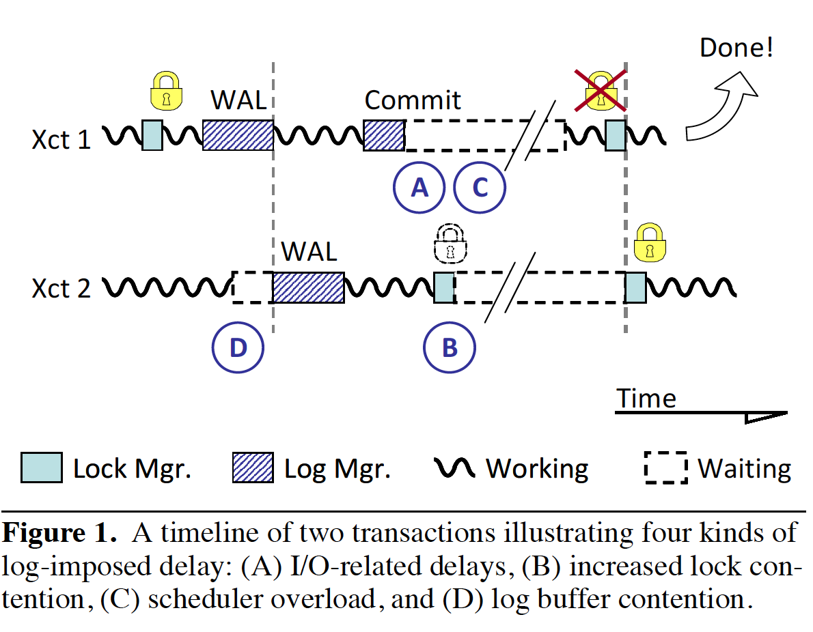

Aether: A Scalable Approach to Logging

本篇论文讨论的是WAL在多核机器上的并发性能问题。

论文中指出了数据库系统中4个日志相关的影响扩展性的问题：

a. 小I/O请求导致磁盘饱和；

b. 事务在等待日志flush的时候，拿着锁

c. extensive context switching overwhelms(压倒，淹没) the OS scheduler with threads executing log I/Os

d. 事务串行访问内存中的日志数据结构会造成竞争

想要提出一些解决方案，大概有20% ~ 69%的提升。测试的benchmark是TPC-B和TATP。


# 1. Introduction

背景：系统变成多核。大量事务并行运行时，很多事务都是在等待状态。

log manager是数据库的一个核心组件，也是一个瓶颈点，因为它是中心化设计的，并且依赖I/O。日志flush时间、日志引起的锁竞争以及内存中的log buffer的竞争，都会影响扩展性。


## 1.1 Write-Ahead Logging and Log Bottlenecks




几乎所有的数据库系统都设计一个中心化的日志系统，用来保护数据 corruption 和crash之后提交的数据不会丢失。WAL可以让事务修改过的数据页不用写到磁盘。

按照图1描述的，有4个类型的延迟，会影响事务。

** I/O 相关的延迟(A)** 。系统必须保证事务提交之前，log record 到达非易失存储。log flush的时间比较久。log flush还是串行的，多个小请求，会让日志设备负载很高。固态硬盘会好很多。还可以使用一些group commit[8]的手段优化。

** 日志引入的锁竞争(B) **. 所有的写锁都要拿着，直到日志刷新完成。因为锁竞争，系统75%的时间都是空闲的。

** Excessive context switching (C)**. log flush的影响除了IO延迟，还会导致事务等待，需要重新调度。上下文切换和调度会消耗CPU时间，并且不能跟其它工作重叠。多核环境下，硬件上下文的大量切换会导致调度称为瓶颈，如果可执行thread积累的速度比OS能够调度的还要快。

** Log buffer竞争(D)**. 上面的几个瓶颈消除后，就能看到很多线程都在争抢Log buffer。所以可以认为在未来Log buffer是一个最具威胁的扩展瓶颈点。

异步提交可能是最可能消除日志瓶颈的方法。

## 1.2 A Holistic Approach to Scalable Logging

这篇文章介绍Aether，一个完整的日志扩展解决方案，并且证明如何在现代硬件提供方法。
第一，有一个Early Lock Release (ELR),减轻日志引入的锁竞争。ELR在很久之前就提到过多次，但是在主流数据库引擎中并没有使用。ELR可以提高15%~164%的吞吐，尤其是logging to fast flash disk的时候。

第二，Flush Pipelining，允许大部分事务提交时不触发上下文切换。与ELR协同一起，可以跟异步提交一样提升性能但是不损失持久性。

最后，有三个log buffer设计的改善，包括一个新的 consolidation(固结，整合)-based backoff方案，可以让线程们在遇到竞争时聚合它们的请求。

# 2. RELATED WORK
Virtually all database engines employ some variant of
ARIES [14],一个复杂的write-ahead日志系统，集成了支持并发控制的事务回滚和灾难回复，并且允许系统完整的恢复，即使恢复被新的crash重复中断。为了能够达到一个高的鲁棒性，并且拥有良好的性能，ARIES与系统的其它组件紧紧配合，尤其是锁和buffer pool manager，并且对一些访问方法的设计有非常强的影响，比如B+ Tree索引[13]。经典的日志被设计成了一个单一的全局数据结构，由所有的事务共享，使之成为了高并发系统的潜在瓶颈。即使一个单一线程数据库系统，典型的OLTP负载中，日志的大概开销在总时间的12%[7]。

最近一些研究[12][3]评估了固态硬盘在日志中的作用，证明能够巨大提升响应时间和小I/O问题。然而，即使最快的flash磁盘也不能减轻所有的开销，因为日志刷新要求阻塞，因此会引起OS调度。

日志 group commit [8][18]策略通过聚合多个请求，将日志flush聚合成单个I/O操作来减轻日志磁盘的压力。group commit 并不能减少不期望的context switch，因为事务必须阻塞等待日志的通知，而不是阻塞I/O请求。

Asynchronous commit [16][17] 扩展了group commit，不仅仅聚合I/O请求，还允许事务可以不用等待这些请求完成而直接完成。
这个优化完全将log flush的时间从关键路径上移除了，然而牺牲了持久性。如果对应的log record没有持久化并且crash的话，已经提交的数据可能会丢失。尽管不安全，异步提交在商业和开源数据库系统上应用很广泛，因为它提供了很好的性能提升。 相对应的，Aether 达到了这个性能提升，还没有牺牲持久性。

DeWitt et al. [4] 研究出来一个事务可以在日志刷新前安全的释放锁，不过要在特定的条件满足时。 IVS [5] 实现了这个优化但是他的正确性最近才证明[21]. 我们把这个技术当做ELR然后在第3章节做评估。
内存数据库引擎的日志实现是一个特殊的挑战，因为它是唯一的I/O操作。 I/O时间和短事务导致的高并发和log buffer竞争都有影响。现在有些建议是减少日志（还有它的开销）[22]，复制每个事务到多个数据库实例，然后以来hot fail-over来维护持久性。
Aether处理了log flush延迟和log buffer的竞争问题，所以也非常适用于内存数据库。

# 3. MOVING LOG I/O LATENCY OFF THE CRITICAL PATH

事务开始后，日志落盘前，都会一直拿着锁。这样别人不会访问到未提交数据

## 3.1 Early Lock Release
DeWitt et al. [4] 中有一个方法，可以让事务落盘之前，释放掉锁。其它读取之前提交事务的数据的事务，就会依赖它，并且在它的log record落盘之前，不允许返回结果给用户。串行日志实现自然而然的就保留了这个属性，因为依赖的事务的log record必须总要在它之前提交的事务落盘后才能落盘，同样也会在之后持久化(note: 不过还是可以快一点，之前是必须等前一个事务落盘，现在是自己可以先提前读取数据,如果用pipeline角度考虑，还是更快一点)。就像[21]中展示的一样，系统必须符合两个条件来做early lock release，来保持可恢复性（preserve recoverability）:
1. 每个依赖的事务的提交log record都是在对应的之前提交事务的log record之后写入磁盘；
2. 当pre-committed 事务终止，所有的依赖事务也必须终止。大部分系统很自然符合这个条件; 在插入commit record之后除了释放锁就不再工作，因此在恢复的时候只能回滚所有未提交的事务。

ELR通过确保正在提交的事务比如等待它的提交操作完成来将log flush的延迟从关键路径中移除，释放数据库锁，这样其它的事务就可以立即获得这些锁然后继续运行。现代数据库系统并没有实现ELR，并且这篇文章可能是第一个分析经验上的ELR性能的。我们假设这是异步提交[16][17]的作用，已经免去了ELR，并且在几乎所有主流系统中实现了。系统不需要牺牲持久性就可以从ELR中获取很大收益，包括锁竞争和long log flush time。

## 3.2 Evaluation of ELR

我们使用TPC-B[24]来评估ELR。TPC-B是一个数据库压力测试工具并且有严重的锁冲突。Figure 3 shows the benefit of ELR over a baseline
system as we vary the two major factors which impact its effectiveness:
锁竞争和I/O延迟. The y-axis shows
speedup due to ELR as the skew of zipfian-distributed data
accesses increases along the x-axis. 更低的斜率表示更均匀的访问和更少的锁冲突. Different log device
latencies are given as data series ranging from 0 to 10ms. The first series (0ms) is measured using a ramdisk which imposes almost no additional delay beyond a round trip through the OS kernel (40-80μs). The remaining series are created by using a combination of asynchronous I/O and high resolution timers to impose additional response times of 100μs (fast flash drive), 1ms (fast magnetic drive), and 10ms (slow magnetic drive).

如图所示，ELR在低速设备上的提升最高35倍，但是存在竞争的flash设备上是2倍。 This effect occurs because transactions
are short even compared to 100μs I/O times, and ELR eases
contention by removing that delay from the critical path. As write performance of most flash drives remains unpredictable (and usually slower than desired) ELR remains an important optimization even as systems move away from magnetic media.

不同的锁竞争会在三个阶段影响性能。
For very low contention, the probability of a transaction to request
an already-held lock is low. Thus, holding that lock through the log
flush does not stall other transactions and ELR has no opportunity
to improve performance. At the other extreme, very high skew
leads to such high contention that transactions encounter held
locks even with no log flush time. In the middle range, however,
ELR significantly improves performance because holding locks
through log flush causes stalls which would not have arisen otherwise.
The sweet spot becomes wider as longer I/O times stretch out
the total transaction length in the baseline case. Finally, by way of comparison, the intuitive rule that 80% of accesses are to 20% of
the data corresponds roughly to a skew of 0.85. In other words,
workloads are likely to exhibit exactly the contention levels which ELR is well-equipped to reduce.

我们发现即使现代数据库引擎也可以从ELR中获得收益。下一章节会证明，这是一个非常重要的替换异步提交的组件。

# 4. DECOUPLING OS SCHEDULING FROM LOG FLUSH OPERATIONS

log flush的延迟有两个发起点：真正的I/O等待时间和要求等待block和unblock的上下文切换。 已经存在的log flush优化，比如group commit，关注点在I/O等待时间，没有解决线程调度。 Similarly, while ELR
removes log flush from the critical path of other transactions
(shown as (B) in Figure 1) the requesting transaction must still
block for its log flush I/O and be rescheduled as the I/O completes
(shown as (A) in Figure 1). 不像I/O等待时间，OS可以跟其它工作交叉重叠，每个调度角色消耗几微秒CPU时间不能交叉重叠。

调度和上下文切换的开销变得越来越重要，有好几个原因。首先，高性能固态存储提供了十毫秒计的访问时间，使调度变成了总延迟中重要的一个因子。其次，core的指数级增长，让调度的负担也很重，因为每个事务结束OS都需要调度。调度器必须协调所有core上的调度。过度的上下文切换使调度成为瓶颈，表现出来是低CPU利用率和很高的System 时间。

过度的上下文切换解释了为什么仅仅有group commit不是完整的可扩展，并且why asynchronous commit is popular despite being unsafe. 后者减轻了事务提交伴随的上下文切换，然而前者并没有。

## 4.1 Flush Pipelining
为了减轻调度瓶颈（因此提高CPU利用率和吞吐），数据库引擎必须从线程调度中将事务提交分离出来。我们提出了Flush Pipeling，允许代理线程在事务log flush时detach，这样可以做其它事情，在flush完成时重新resume事务。

flush pipeling的操作如下。首先，代理线程异步提交事务（不用等待log flush完成）。然而，不像异步提交，立即返回给客户端，而是脱离事务，将它的状态放到日志中，然后运行其它事务。有一个daemon线程触发log flush，使用类似 group commit的策略(e.g. “每X个事务刷新一次,
L bytes logged, or T time elapsed, whichever comes first”).在每次I/O完成后，daemon通知newly-hardened事务的线程, 重新关联到每个事务, 完成提交过程并且返回结果给客户端。生成log record的事务要终止的话，在rolling back之前也要hardended. 代理线程处理这种场景，相对传统（非乐观）并发控制来说比较少，不用将事务传给daemon。

flush pipeling结合ELR可以提供异步提交一样的吞吐，并且不需要提升任何安全性。只有日志的daemon线程需要等待时间并且因为日志刷新请求而调度，代理线程pipeling多个请求，隐藏了更长的延迟。

## 4.2 Evaluation of Flush Pipelining
flush pipeling成功并且安全地通过断开事务提交与调度的关联，将日志从系统关键执行路径上移除了。

# 5. SCALABLE LOG BUFFER DESIGN

大部分数据库引擎都使用某些ARIES的变体，给每个log record都赋值一个唯一日志序列号（LSN log sequence number）。LSN就是磁盘地址的编码，像数据页写入磁盘的时间戳，也作为在内存和磁盘上指向 log record的指针。在log buffer中也作为地址使用，因此生成LSN也会预留buffer空间。为了让数据库在重复的失败中也保持一致性，ARIES给LSN的生成规定了严格的顺序约束。正确性并不要求一个完整的全序, 正确的部分顺序(partial order)变得越来越复杂，并且为了获得性能优化，开始追求 interdependent
(see Section A.5 of the Appendix for further discussion). 在log buffer中插入一个记录包含三个不同的阶段：

1. **LSN生成和log buffer 申请**。线程必须首先声明最终需要的空间大小。尽管是穿行的，LSN生成很短并且是可预见的，除非特殊场景，比如buffer 环绕或者log buffer满了。
2. **log record插入**。线程复制log record到buffer空间。
3. **log buffer 释放**。事务释放buffer 空间，允许log manager将record写入到磁盘。

一个直接的日志插入实现，在执行三个阶段之前要一个中心化的mutex，然后buffer释放时释放mutex（附录Algorithm 1中有伪代码）。这个方法的有点就是简单：日志插入消耗非常少，并且在整体(monolithic)场景下buffer释放跟mutex释放一样简单。

一个整体日志插入的缺点就是它使buffer填充操作串行化了，即使buffer区域从来不会重叠，这样就把它的开销直接放到了关键路径上了。另外，log record的大小的范围非常大，这就使复制开始不可预测。一个大的log record会阻塞其它的线程操作。

为了永久的减少log buffer的竞争，我们探测让访问日志的开销，独立于log record的大小和插入线程的个数。 

## 5.1 Consolidating（加固，合并） Buffer Allocation

一个log record包含一个标准的头，然后任意的payload。Log buffer分配器在这种意义上是可组合的，就是两个连续的请求都包含一个log header和任意长度的payload结尾。我们利用这种可组合性，让线程将它们的请求合并成group，从关键路径上脱离切分、填充group的buffer space，然后最后再将日志当做一个unit还回去。 To this end we extend the idea of elimination-based backoff [9][15], a hybrid approach combining elimination trees [19] with backoff. 遇到竞争退避(back off)的线程，不是sleep或counting cycle，而是聚集在一个elimination array中，在一个辅助的位置集合中，尝试合并它们的请求。

当elimination是成功的线程满足它们的请求而不用返还共享资源时，backoff（补偿，回退，退避）就非常高校。例如，stack非常适合elimination，因为push和pop请求刚好相互匹配，然而backoff可以通过elimination array直接相互取消并且离开。 类似的，线程遇到log insert冲突时，回退到一个consolidation array，然后合并它们的请求，再重新操作log buffer。 我们用consolidation，而不是elimination，是因为不像栈或计数器，线程在合并它们的请求之后还是要继续合作，这样最后一个线程可以释放group的buffer space。类似elimination array，任何数量的线程都可以consolidation到一个单独的请求中，有效地将log buffer的竞争限制到了array的数量从而保护了log buffer, 而不是系统中线程的个数. 算法2（附录）提供了consolidation array-based buffer分配的架构。

```
Algorithm 2 – Log insertion with consolidated buffer acquire
1 log_insert(size, data):
2 	if (lock_attempt(L)== SUCCESS)
3 		lsn = buffer_acquire(size)
4 		buffer_fill(lsn, size, data)
5 		buffer_release(lsn, size)
6 		return /* no contention */
7 	end
8 	{s, offset} = slot_join(size)
9 	if (0 == offset) /* slot owner */
10 		lock_acquire(L)
11 		group_size = slot_close(s)
12 		replace_slot(s)
13 		lsn = buffer_acquire(group_size)
14 		slot_notify(s, lsn, group_size)
15 	else /* wait for owner */
16 		{lsn, group_size} = slot_wait(s)
17 	end
18 	buffer_fill(lsn+offset, size, data)
19 	if (slot_release(s) == SLOT_DONE)
20 		buffer_release(lsn, group_size)
21 	end
22 end
```

consolidation的级联作用是每个group只有第一个线程需要去争取buffer space，并且只有最后一个离开的线程必须等待去释放它。Figure 6(C)
depicts the effect of consolidation; the first thread to arrive is
joined by two others while it waits on the log mutex and all three
proceed in parallel once the mutex acquire succeeds. However, as
the figure also shows, consolidation leaves significant wait times
because only buffer fill operations within a group proceed in parallel;
group之间的操作仍然是串行的。 在系统中给出足够多的线程，最多每组有一个线程大概率的插入一个大的log record，会延迟其它的group。

## 5.2 Decoupling Buffer Fill

因为buffer fill操作不一定是串行的（record不会交叉重叠），并且有不同的消耗，所以把它们从关键路径上移除非常重要。所有请求了buffer区域的线程可以以任何顺序安全的填充这些区域，只要它们按照LSN的顺序释放就可以。因此我们修改了原始的算法，线程可以在获取buffer space之后立即释放mutex。buffer fill 操作就可以pipeline化，下一个线程可以今早的请求它自己的buffer region。将log insert操作从拿着锁状态下脱离出来，导致了一个buffer release操作，变成了第二个临界区间。就像LSN生成，buffer release必须是串行的，以避免在log中产生空洞。log record也必须按照LSN的顺序写入磁盘，因为恢复的时候遇到第一个gap时必须停下来，crash发生的话，任何在gap之后的已经提交的事务都会丢失。不要求持有mutex，但是在释放自己的buffer region之前，每个线程都必须等待前一个buffer释放掉（附录算法3给出了伪代码）。
With pipelining in place, arriving threads can overlap their
buffer fills with that of a large log record, without waiting for it to
finish first. 图6(D)描述了改进的并发，导致了在buffer 请求阶段非常大的减少了等待时间。尽管record size的不同分布会限制可扩展性，因为必须按照顺序释放buffer，但是我们发现实际上这不是一个问题，在现实中log record size的范围还不足以增加额外的复杂。
We consider this matter further in Section A.3 of the appendix
and propose a solution which provides robustness in the face of
skewed log record sizes with a 10% performance penalty.

## 5.3 Putting it all Together: Hybrid Log Buffer

前面两个章节我们描述了(a)一个以consolidation array为基础的，用来减少线程进入临界区的线程个数，还有一个(b)分离buffer fill，允许线程在临界区之外pipeline buffer fill。两个都没有消除所有的竞争。 两个是正交的，但是可以很容易的组合起来。Consolidating groups of threads
limits log contention to a constant that does not depend on the
number threads in the system, while providing a degree of buffer
insert pipelining (within groups but not between them). Decoupling
buffer fill operations allows pipelining between groups and
reduces the log critical section length by moving buffer outside, 这样就使性能对log record size相对不太敏感。
The resulting design, shown in Figure 6(CD), achieves bounded
contention for threads in the buffer acquire stage and maximum
pipelining of all operations.

# 6. PERFORMANCE EVALUATION

# 7. CONCLUSIONS
log manager的性能变得越来越重要，因为数据库引擎持续的利用硬件并行提高性能。 然而日志的串行化天性，还有长时间的I/O时间，让log变成了持续增长的瓶颈。因为可用的硬件并行以指数级增长，中心化的log buffer引起的竞争阻止了扩展。一个新的算法，consolidation array-based backoff，体现分布式系统的概念，将前面的串行日志插入操作转换成一个并行的，即使在比现代系统可以生成的更高的竞争下也可以很好的扩展。 We
address more immediate concerns of excessive log-induced context
switching using a combination of early lock release and log
flush pipelining which allow transactions to commit without triggering
scheduler activity, 并且没有牺牲安全性或持久性.
放一起讲，这些技术让数据库日志管理从系统的关键路径中移除，最大化性能，跟可用的并行一起持续增长。