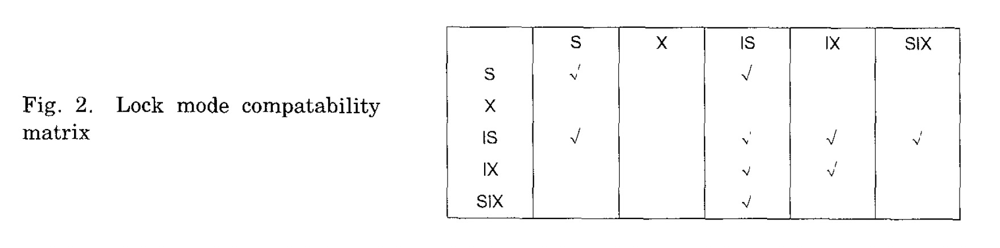

ARIES: A Transaction Recovery Method Supporting Fine-Granularity Locking and Partial Rollbacks Using Write-Ahead Logging

ARIES Algorithm for Recorvery and Isolation Exploiting Semantics

支持事务的部分回滚、细粒度锁（比如记录锁）、以及使用WAL日志恢复。

We introduce the paradigm（范例） of repeating history to redo all missing updates before performing the rollbacks of

the loser transactions during restart after a system failure.

ARIES uses a log sequence number in each page to correlate the state of a page with respect to logged updates of that page.

一个事务的所有更新都会记录日志，包括在回滚时的执行。

By appropriate chaining of the log records written during rollbacks to those written during forward progress, a

bounded amount of logging is ensured during rollbacks even in the face of repeated failures during restart or of nested rollbacks.

We deal with a variety of features that are very important in building and operating an industrial-strength transaction processing system

ARIES supports

fuzzy checkpoints, selective and deferred restart, fuzzy image copies, media recovery, and high

concurrency lock modes (e. g., increment /decrement) which exploit the semantics of the operations

and require the ability to perform operation logging.

关于Buffer manager的策略，ARIES可以灵活的实现多种。可以高效的支持变长对象(这里的对象是指记录或其它？)

重启时开启并行，面向页的redo和逻辑undo，可以增强并发和性能。

我们展示了为什么有些System R 的日志和恢复范例，那些基于shadow page的技术，需要在WAL的上下文中作出改变。

ARIES不仅适用于数据库系统，还可以用于持久化的面向对象语言、可恢复的文件系统和基于事务的操作系统。

# Introduction

这里先介绍了几个基本概念。

## 1.1 Logging, Failures, and Recovery Methods

事务的概念，封装了ACID(Atomicity, Consistency, Isolation和Durability)。事务概念的应用也不仅仅是数据库领域。确保原子性和持久化是在并行执行和多种失败时需要面对的非常重要的问题。这个问题的解决方案可以从多个维度来评判：

- 在一个业内和跨页时支持的并发度，
- 生成结果逻辑的复杂性，
- 非易失存储上的空间开销以及数据和日志在内存中的开销，
- 在重启恢复和正常重启时需要的同步和异步I/O的个数，
- 支持的功能种类（部分事务回滚等），
- 重启恢复时执行的处理量(amount of processing)，
- 重启恢复时支持的处理并发度，
- 死锁引起的系统诱发事务(system-induced transaction)回滚的程度, 
- 存储的数据的约束 (比如要求所有记录有唯一键值，要求对象的最大大小是页大小等等）, 
- 可以支持基于通讯和其它属性的允许并行执行的novel lock mode， 并行操作比如不同事务在同一个数据上的increment/decrement, 
- 等等.

ARIES可以处理好上面所有的维度。

The log becomes the source for ensuring either that the
transaction’s committed actions are reflected in the database despite various
types of failures, or that its uncommitted actions are undone (i.e., rolled
back).
当记录的信息反映了数据对象的内容，这些日志记录也就是重建损坏或丢失数据的源泉。从概念上讲，日志可以被认为是一直增长的连续的（sequential）文件。每个日志记录都有一个LSN(log sequence number)。LSN是递增的序列。一般情况下还是对应的日志记录的逻辑地址。有时候会使用版本号或时间戳作为LSN。如果为了存储不同的数据片使用了多个日志，那么必须使用两阶段提交协议。

非易失版本的日志存储的地方通常称为stable storage。一旦合适的数据库镜像副本(归档转存)产生，那些归档日志记录可能会被丢弃，并且介质恢复时也不在需要这些日志记录。

当日志记录写入时，首先会放到易失存储的buffer中。在一定时间或达到特定的LSN时，按照日志页的顺序，刷到stable storage上。这种称为forcing日志达到LSN。这种force动作除了事务和buffer manager，还可能是系统进程在后台周期性的刷新。

为了方便阐述，假设每个日志记录只描述更新的单个页面。日志记录中的undo部分(与redo对应)，提供如何undo事务做的改变。包含undo和redo信息的日志被称为undo-redo日志记录。有时候，日志记录也可能只包含undo信息或只包含redo信息。这些日志记录称为redo-only日志记录或undo-only 日志记录。根据执行的动作的不同，undo-redo信息可能记录物理的（比如更新前和更新后的镜像或对象中特定字段的值）或操作性的（比如记录15的字段3增加5，记录10的字段4减去3）。操作日志允许利用高并发锁模式，利用数据上的操作语义。例如，对特定的操作，一个记录上的同一个字段可以有许多事务的未提交更新。这些比那种可以允许更多的并发，就是通过严格的运行[3]中的模式来运行，修改后的对象必须在提交期间使用排他锁(X模式)。

ARIES使用了WAL协议。在基于WAL的系统中，一个更新的页还会写回到非易失存储中读取它的地方。就是在非易失存储上执行in-place updating。作为对照，shadow page技术不是这么做的，比如System R和SQL/DS。那样的话是更新后的页写到非易失存储的不同位置，之前的版本用来执行数据库恢复。

WAL协议可以确保日志记录中表示的数据修改，变更的数据在非易失存储上可以替换之前版本之前，日志记录已经落在了stable storage上。也就是说，日志记录的undo部分写入到stable storage之前，系统不允许在非易失存储上写入更新的页面。To enable the enforcement of this protocol, systems using the WAL

method of recovery store in every page the LSN of the log record that

describes the most recent update performed on that page.为了能够执行这个协议，系统利用恢复存储的WAL方法，在每一页中描述了最近在页面上执行的更新的日志记录的LSN。

事务的状态也会存储在日志中，在事务的提交状态和所有的日志数据成功的记录在stable storage（刷新日志到事务提交的LSN）之前，事务不能被认为是完成的。这样的话，重启恢复时，可以恢复任何已经完成的、但是更新过的页面还没有写入到非易失存储上的事务。在所有的log record的redo部分完全写入stable storage之前，一个事务是不能进入到commit processing的。

处理三种类型的failure：事务或进程、系统、介质或设备(media or device)。当一个事务或进程出现问题的时候，事务一般处于它的更新都应该undo的状态。当系统异常出现时，一般情况下会出现虚拟存储内容会丢失，事务系统会重启并利用数据库和日志的非易失存储执行恢复。当介质或设备异常时，一般情况下介质上的内容会丢失并且必须使用一个镜像副本和日志来恢复。

Forward processing是指系统在正常状态下执行的更新操作，可能是由数据操作和应用程序本身发起的事务更新。Partial rollback是指在事务运行过程中可以创建一个savepoint，并且后面可以恢复到之前的savepoint。这与total rollback相对应。Nested rollback 是说一个partial rollback后跟着一个total rollback或另一个partial rollback，而那个rollback结束的点在事务中比第一个rollback结束点更早。Normal undo 是指系统正常运作时全部或部分事务回滚。normal undo 可能是事务发起的也可能是系统发起的，比如死锁或一些错误（完整性校验冲突）。Restart undo 是指在系统异常恢复时事务回滚。所有的日志记录都会有一个PrevLSN，关联前面一条log record。很多WAL系统，rollback时的更新操作时使用称为CLR(compensation 补偿 ，修正 log record)来记录。ARIES中，CLR更新不会做undone，因此CLR被视为redo-only log record。

Page-oriented redo is said to occur if the log record whose update is being

redone describes which page of the database was originally modified during

normal processing and if the same page is modified during the redo processing. redo更新时不需要访问表和索引的内部描述符。就是不需要检查数据库的其它页面。这与logical redo相对应。使用logical redo的系统因为没有单独记录索引的变更，所以在redo时需要访问内部描述符和数据库的其它页面。page-oriented redo可以让系统支持对象间独立的恢复(recovery independence amongst objests)。这会让介质恢复变得很简单。

用类似的方式可以定义page-oriented undo 和 logical undo。logical undo可以支持更高的并发度。因为logical undo有合适的并发控制协议，可以让一个事务中未提交的更新移动到另一个页面上。如果只有page-oriented undo，那么后面的事务就只能等前面的事务提交。page-oriented redo和page-oriented undo恢复时比较快，因为不需要访问数据库的其它页面。

## 1.2 Latches and Locks

通常latches用来保证数据物理上的一致性，而locks是用来保证数据的逻辑一致性。通常latches的时间要比Locks的短。死锁通常也不会上报有关latches的信息。latch的成本要比lock低很多。latches成本低的原因是latch control information常常在虚拟内存中的固定位置，可以直接定位到latch information。这篇文章和一些其他文章中描述的，一个事务通常只会同时拥有两到三个latch。这样的话，可以直接在事务中永久放置一个latch request block。一般来说，所有事务当前拥有的锁和请求过的锁会放在一个单独的、中心化的hash table中。访问一个lock时通常还会获取一个或多个latch。

Lock可以有多种模式，比如S(shared),X (eXclusive)， IX(Intention eXclusive), IS(Intention Shared)和SIX(Shared Intention eXclusive)，还有不同的粒度(granularities),比如record(tuple)，table(relation)和文件(tablespace)[32]。图2展示了几种锁模式的兼容视图。

在层级上讲，意向锁通常是在高级别一点的地方用的，S和X锁是在低级别的对象上用的，比如record。S和X的锁，如果在高级别上已经获取了，同时暗示在低级别的对象上也有这些锁。另外，一些文章定义了更丰富的锁模式[2, 38, 45, 55]。

有条件锁和无条件锁。有条件锁是指如果不能立即拿到锁，不会等待在那里。无条件是指会等待在那里。

锁拿着的时间也会不同：

- 一个unconditional request 想要获取一个instant duration lock，意思是这个锁不一定要真正的给它，但是lock manager必须延迟返回这个锁请求，指导这个锁可以授权给它。
- Manual duration lock会在一定时间之后释放，通常是在事务终止之前。
- Commit duration lock只会在事务终止时释放，比如在提交或回滚完成后。

上面讨论的conditional request、different mode和duration，除了commit duration，都适用于latches。

## 1.3 Fine-Granularity Locking

很多非关系型数据库支持了Fine-granularity lock，但是关系型数据库不能做到。这里还有很多问题需要处理。

## 1.4 Buffer Management

 Buffer Management是事务系统的一个组件，管理buffer pool，处理I/O写入到非易失存储或从中读取。

BM还要支持latching pages。

Buffer Management有多种策略。

- steal policy: 如果一个页被修改了，但是还没有提交，就可以写入到非易失存储。

- no-steal policy: 与steal policy相反。

steal隐含了在正常和重启回滚时，必须做一些undo工作。

- force policy: 如果所有更新过的页都写入到持久化后才允许提交
- no-force policy: 与force policy相反。

使用force policy时，重启恢复时，已经提交的事务，不需要再做redo。

- Defered updating是指，事务发起相应数据库调用时，即使在虚拟存储数据库buffer中，更新不是原地(in-place)执行。在其它地方保存一个pending list记录做的更新，仅在事务完全确定提交时，才做in-place变更。如果事务需要回滚，那么就丢掉或忽略pending list。 defered updating策略影响一个事务是否可以看到它自己的更新，以及是否可以支持部分回滚。

# 2 GOALS

Simplicity. 并发和恢复非常复杂的主题。我们想要做出一个简单、强大和灵活的算法。

Operation logging。恢复方法必须可以执行operation logging（和value logging），这样才能支持语义上的rich lock mode。这样可以支持两个事务同时修改同一条数据，只要他们的操作在语义上是兼容的（比如increment/decrement操作）。应该澄清一下，支持执行value或state logging（比如记录修改数据的before-images和after-images）的恢复方法不能支持operation logging。支持operation logging的难点是，我们需要精确地使用类似LSN这样的概念，追踪某一页对应日志动作(redo/undo)的精确状态。如果不能确定原始的更新是否存在，那就不能执行对应的redo/undo。这就是说，如果一个或多个事务曾经修改过某个页面，现在开始回滚了，就要精确地知道在回滚期间，这些页面曾经被怎么操作过，以及回滚到目前完成了多少。这就要求在回滚期间做的更新操作，也要通过CLR(compension log records)记录下来。LSN的概念，可以避免某页上已经对应了某个LSN的信息，再做对应的redo动作。也同样可以避免某个对应了LSN的页面，再做undo动作。operation logging可以执行 logical logging，不一定要明确的记录每个页面上的变更，这样可以节省日志空间。例如，控制信息的变更，像页面上空闲空间的的数量，不需要做日志。redo和undo可以在逻辑上执行。

Flexible storage management. 高效的支持存储和操作变长数据的操作是很重要的。这里的想法是，避免离线对垃圾回收的空间做重新组织，回收的空间是由删除和更新导致的数据收缩。希望恢复算法和并发控制方法的logging 和locking 自然而然都是逻辑上的，这样垃圾回收导致的页面内数据移动不会导致加锁移动的数据，或者给这个移动做日志。对于一个索引来说，就意味着一个事务可以拆分一个叶子页面，即使这个页面当前有一些另一个事务插入的未提交的数据。这可能会导致使用日志做面向页面的undo，可能在必要时使用逻辑undo。更进一步，我们希望可以让一个事务释放一些空间后可以使用起来，如果必要的话，这些空间可以用在后面的插入动作中。

Partial rollback。新的恢复方法应该可以支持savepoint和回滚到savepoint（partial rollback）的概念。这个处理很关键，以用户友好的方式，整合完整性冲突约束，以及由使用过期缓存信息导致的问题。

Flexible buffer management。

Recovery indepencence。应该可以支持镜像复制（archive dump），并且执行介质恢复或不同粒度的重启恢复，而不是仅仅在整个数据库层级恢复。

Logical undo。

Parallelism and fast recovery。

Minimal overhead。目标是在正常和重启恢复处理时，性能要好。

# 3 Overview of ARIES

ARIES  可以确保在进程、事务、系统和介质异常时，提供原子性和持久性的保障。

# 4 DATA STRUCTURES

## 4.1 Log  Records

- LSN. Log record的日志地址空间第一个字节的地址。是一个单调递增的值。LSN不一定在log record中存放。

- Type. 表示日志类型 compensation log、regular update record、提交协议相关的record（比如 prepare），或者非事务相关的record（比如OSfile_return）。

- TransID. 如果有的话，就是写这条log record的事务标识。

- PrevLSN. 同一个事务中，前一条log record的LSN。

- PageID. 只会在compensation和update record中出现。是record更新的page的ID。PageID包含两部分：一个objectID(比如tablespaceID)， 和一个object中的page number。

- UndoNxtLSN. 只会在CLR中出现。

- It is the LSN of the next log record

  of this transaction that is to be processed during rollback. That is,

  UndoNxtLSN is the value of PrevLSN of the log record that the current log

  record is compensating. If there are no more log records to be undone, then

  this field contains a zero。

- Data. redo/undo 描述的更新的内容。CLR只会包含redo信息。update只会以逻辑形式记录。对象的完整redo/undo信息不需要做日志。对于increment/decrement类型的操作，before/after的镜像信息不需要记录。记录操作类型和increment/decrement的数量就可以。这里的信息还会用来确定使用哪个动作来执行redo/undo。

## 4.2 Page Structure
## 4.3 Transaction Table
在重启时，使用一个叫做transaction table的表，来跟踪活跃事务。

## 4.4 Dirty_Pages Table

# 5 Normal Processing
## 5.1 Updates
正常处理过程，事务可能在正常向前进行，部分回滚或全部回滚。回滚可能是系统或应用发起的。引起回滚的原因可能是死锁、错误检测、完整性约束冲突、非预期的数据库状态等。

# 6 Restart Processing

# 7 Checkpoints During Restart

# 8 Media Recovery

# 9 Nested Top Actions

